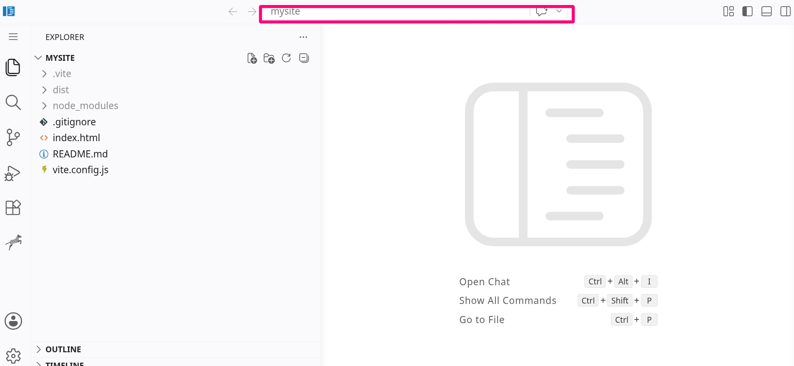
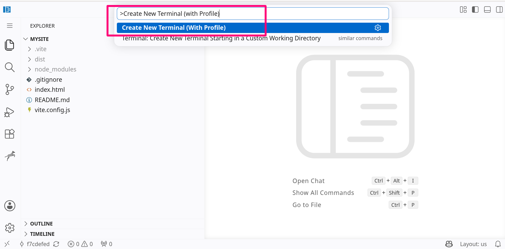
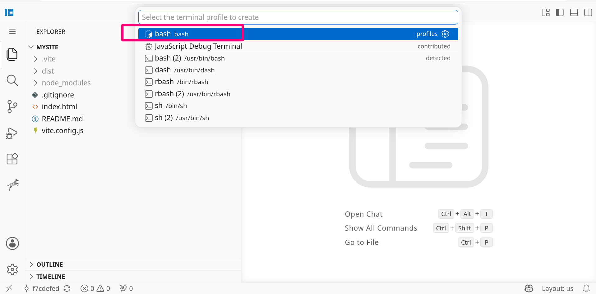
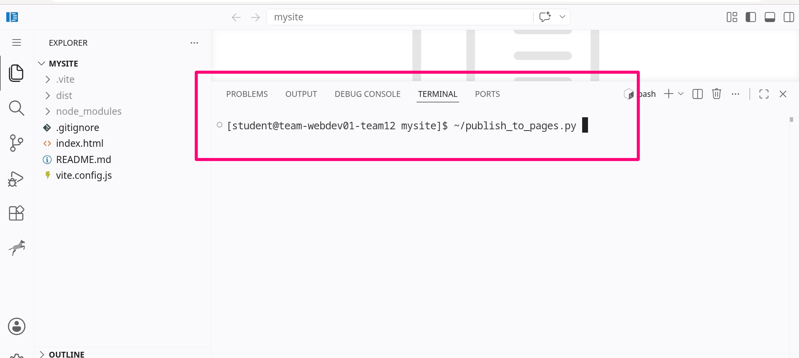

<br>
<br>

{fig-align="center" width=500px}

# Getting started

Welcome to the online coding platform. This guide walks you through logging in, opening your browser-based workspace, editing a web page, and using the built-in AI assistant.

## What you get

- **VS Code in Browser** — Each team gets a dedicated code-server instance accessible via `code-server-container-platform.parami-ai.org`.
- **Live Web Preview** — Vite dev server with hot-module replacement (HMR) accessible via `mysite-container-platform.parami-ai.org`.
- **Central Login Portal** — Single sign-on at [portal-container-platform.parami-ai.org](https://portal-container-platform.parami-ai.org).


# Step-by-step usage guide

## 1. Log in to the platform

- Open the [central login portal](https://portal-container-platform.parami-ai.org).
- Enter your team credentials.
- You will be taken to your dashboard.

:::{.callout-tip}
Bookmark the portal link so you do not have to type the URL each time.
:::

<video controls width="100%">
  <source src="login.mp4" type="video/mp4">
  Your browser does not support the video tag.
</video>

**Key steps shown:**

- Navigate to the platform URL in your browser.
- Sign in using your assigned credentials.

---

## 2. Open your workspace and live preview

- Launch the browser-based VS Code workspace.
- When VS Code asks whether to trust the workspace, click **Trust**.
- Open the live website preview to see your site in real time.

:::{.callout-warning}
## Trust the workspace
If you do not click **Trust**, you will not be able to edit files or use the AI plugin.

This is safe: the VS Code workspace runs on our server, not on your personal computer.
:::

<video controls width="100%">
  <source src="open_vscode.mp4" type="video/mp4">
  Your browser does not support the video tag.
</video>

**Key steps shown:**

- Launch the browser-based VS Code workspace.
- Open the live website preview panel.

---

## 3. Edit HTML and see changes live

- Open the HTML file you want to change.
- Make your edits.
- Watch the updates appear instantly in the live preview window.

<video controls width="100%">
  <source src="edit_html.mp4" type="video/mp4">
  Your browser does not support the video tag.
</video>

**Key steps shown:**

- Open the HTML file to start editing.
- Watch updates appear live in the preview window.

---

## 4. Use the Zebra Zoo Code AI plugin

The Zebra Zoo Code AI plugin helps you edit your site faster.

- Import the default settings.
- Configure your OpenRouter API key.
- Ask the AI to make changes for you.
- Review the AI’s suggestion:
  - **Accept** it if it looks good.
  - **Reject** it if it does not meet your needs.
  - In either case, type feedback in the prompt box to help the AI learn what you want.

:::{.callout-caution}
## Watch your spending
Every prompt and every word the AI processes costs money. Keep requests clear and focused to avoid unexpected charges.
:::

<video controls width="100%">
  <source src="ai_plugin.mp4" type="video/mp4">
  Your browser does not support the video tag.
</video>

**Key steps shown:**

- Click the Zebra Zoo Code AI plugin icon.
- Import settings from the default location.
- Configure your OpenRouter API key.
- Ask the AI to edit your site.

---

## 5. Publish your site to GitHub Pages

When you are ready to share your site, use the built-in publish script to push it to GitHub Pages.

### Step 1 — Open the VS Code: top bar

Click the VS Code: top bar to bring up the command palette.

{fig-align="center"}

### Step 2 — Create a new terminal

Type the command `>Create New Terminal (with Profile)` and select it to create a new terminal.

{fig-align="center"}

### Step 3 — Choose Bash

When asked which terminal profile to use, choose **Bash**.

{fig-align="center"}

### Step 4 — Run the publish script

In the terminal, run:

```bash
~/publish_to_pages.py
```

Follow the on-screen instructions to push your site to GitHub Pages.

{fig-align="center"}

:::{.callout-note}
## GitHub login
The script will ask you to log in to your GitHub account. Make sure you use the account where you want the Pages site hosted.
:::

---

# Tips and reminders

- Keep your OpenRouter API key private; do not share it or commit it to your project repository.
- Always click **Trust workspace** when opening VS Code, or you will not be able to edit or use the AI features.
- Review every AI suggestion before accepting or rejecting it, and give feedback when needed.
- Watch your OpenRouter spending: every word you send and receive costs money, so make prompts concise.
- If the live preview stops updating, refresh the preview panel or restart the Vite dev server from the terminal.
- Each team container is isolated on the backend network, so your workspace and preview are independent from other teams.

For further help, contact the platform support team.
