## The Development Nightmare

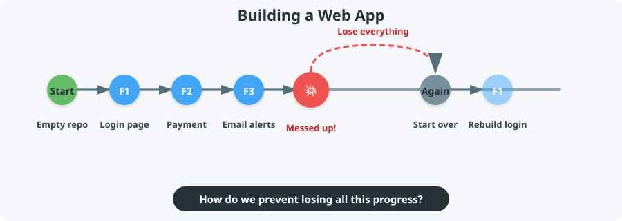

---

## A Familiar Gaming Scenario

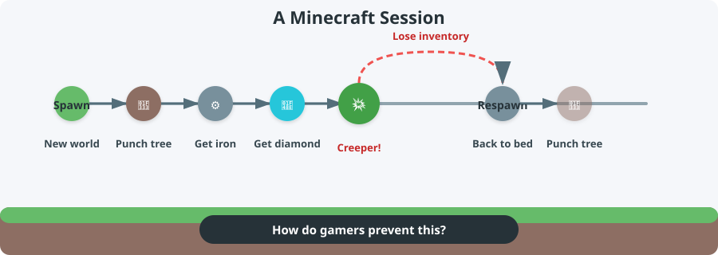

---

## Answer: Use Checkpoints!

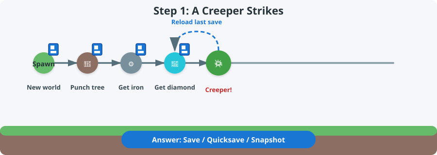

---

## Reload the Checkpoint

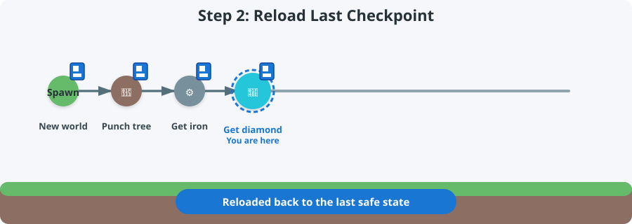

---

## Continue from the Checkpoint

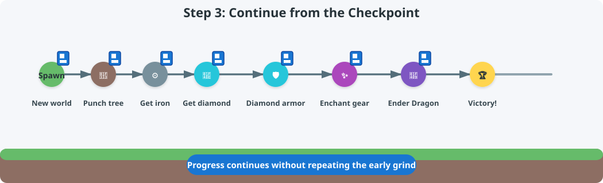

::: {.callout}
**Key idea:** A checkpoint lets you return to a safe state and keep playing without redoing everything.
:::

---

## Git = Checkpoints for Code

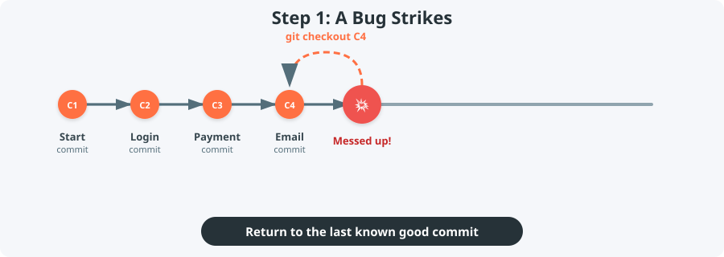

Each Git **commit** is a snapshot of your project.


---

## Checkout the Last Good Commit

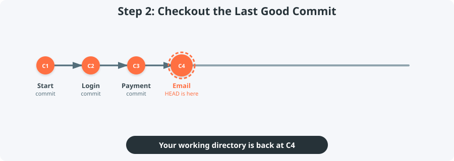

---

## Continue Development

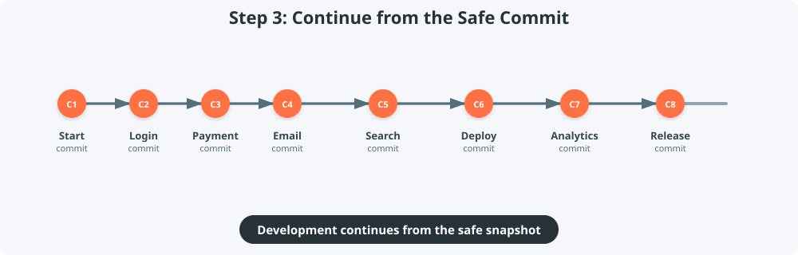

::: {.callout}
**Key idea:** Git commits are snapshots you can return to, compare, and build upon.
:::

---

## Our Demo: A Landscape Scene

We will use this landscape scene to explain Git. Each commit adds or changes something in the scene.

{.landscape-svg}

---

## Our Demo Repository

We will explore a small repo that builds this landscape scene.

```{mermaid}
%%| fig-width: 10
%%{init: {'theme': 'base', 'themeVariables': { 'git0': '#ff7043', 'git1': '#42a5f5', 'git2': '#66bb6a', 'git3': '#ab47bc' }}}%%
gitGraph
    commit id: "Base landscape"
    commit id: "Add house"
    commit id: "Add red tree"
    branch opposite-house
    checkout opposite-house
    commit id: "House opposite river"
    checkout main
    commit id: "House behind tree"
    merge opposite-house id: "Merge opposite-house"
    branch tower-and-ship
    checkout tower-and-ship
    commit id: "Antenna tower"
    commit id: "Ship on ocean TS"
    checkout main
    commit id: "Add pond"
    cherry-pick id: "Ship on ocean TS"
    commit id: "Construction site"
    branch car-park-road
    checkout car-park-road
    commit id: "Car park + road"
    checkout main
    commit id: "Bridge"
    commit id: "Office building"
    branch merge-accept-incoming
    checkout merge-accept-incoming
    merge car-park-road id: "Accept incoming"
    checkout main
    branch merge-reject-incoming
    checkout merge-reject-incoming
    merge car-park-road id: "Reject incoming"
    checkout main
    branch merge-manual-resolve
    checkout merge-manual-resolve
    merge car-park-road id: "Manual merge"
    checkout main
    merge merge-manual-resolve id: "Merge manual resolve"
```

---

### Commits in Action

::: slide-iframe-wrapper
<iframe src="assets/html/linear_history.html"></iframe>
:::

[Open timeline in new tab](assets/html/linear_history.html){target="_blank" .iframe-link}

---

## A Design Dilemma

::: columns
::: column
**Current state**

{.landscape-svg}

`8d1987f` — House behind red tree
:::

::: column
::: {.small-text}
**What if...**

- I want to try the house on the **other side of the river**?
- I move it, then decide it looked **better behind the tree**?
- How can I experiment **without losing** the current version?
:::
:::
:::

---

## What is a Git Branch?

::: mermaid-large
```{mermaid}
%%| fig-width: 10
%%{init: {'theme': 'base', 'themeVariables': { 'git0': '#ff7043', 'git1': '#42a5f5' }}}%%
gitGraph
    commit id: "Base landscape"
    commit id: "Add house"
    commit id: "Add red tree"
    branch opposite-house
    checkout opposite-house
    commit id: "House opposite river"
    checkout main
    commit id: "House behind tree"
```
:::

A **branch** is a separate timeline that starts from a specific commit. You can experiment freely while the original line stays untouched.

---

### Branch in Action

::: slide-iframe-wrapper
<iframe src="assets/html/branch_demo.html"></iframe>
:::

[Open branch demo in new tab](assets/html/branch_demo.html){target="_blank" .iframe-link}

---

## Branches in Real Projects

::: mermaid-large
```{mermaid}
%%| fig-width: 10
gitGraph
    commit id: "Initial setup"
    commit id: "User login"
    branch feature/payment
    checkout feature/payment
    commit id: "Payment form"
    commit id: "Stripe integration"
    checkout main
    commit id: "Dashboard"
    branch bugfix/login-error
    checkout bugfix/login-error
    commit id: "Fix auth bug"
    checkout main
```
:::

In real development, you might branch to build a feature, fix a bug, or try a refactor — all at the same time.

---

## What if we want both houses?

::: columns
::: column


:::

::: column
::: {.small-text}
Now we have two versions of the house. Should we:

- Rebuild on `main` and lose the behind-tree version?
- Rebuild on `opposite-house` and lose the original?
- **Merge** them so both houses appear together?
:::
:::
:::

---

## Merging: Combine Timelines

::: mermaid-large
```{mermaid}
%%| fig-width: 10
%%{init: {'theme': 'base', 'themeVariables': { 'git0': '#ff7043', 'git1': '#42a5f5' }}}%%
gitGraph
    commit id: "Base landscape"
    commit id: "Add house"
    commit id: "Add red tree"
    branch opposite-house
    checkout opposite-house
    commit id: "House opposite river"
    checkout main
    commit id: "House behind tree"
    merge opposite-house id: "Merge opposite-house" type: HIGHLIGHT
```
:::

A **merge** brings two branches back together.

---

### Merge in Action

::: slide-iframe-wrapper
<iframe src="assets/html/merge_demo.html"></iframe>
:::

[Open merge demo in new tab](assets/html/merge_demo.html){target="_blank" .iframe-link}

---

## Merging in Real Projects

::: mermaid-large
```{mermaid}
%%| fig-width: 10
gitGraph
    commit id: "Initial setup"
    commit id: "User login"
    branch feature/payment
    checkout feature/payment
    commit id: "Payment form"
    commit id: "Stripe integration"
    checkout main
    commit id: "Dashboard"
    merge feature/payment id: "Merge payment"
```
:::

In real development, you merge a feature branch back into `main` when it is ready.

---

## Result of the Merge

{.landscape-svg}

`46130e9` — Merge branch 'opposite-house'

---

## What if we want just one change?

::: columns
::: column
**`tower-and-ship` branch**

{.landscape-svg}

`b5580ac` — Add ship on ocean
:::

::: column
::: {.small-text}
**Current `main`**

- `46130e9` — Merge branch 'opposite-house'
- `d1cd048` — Add pond

What if we want the **ship-on-ocean** change on `main`, but not the whole `tower-and-ship` branch?
:::
:::
:::

---

## Cherry-Pick: Copy One Commit

::: mermaid-large
```{mermaid}
%%| fig-width: 10
%%{init: {'theme': 'base', 'themeVariables': { 'git0': '#ff7043', 'git1': '#66bb6a' }}}%%
gitGraph
    commit id: "Merge opposite-house"
    branch tower-and-ship
    checkout tower-and-ship
    commit id: "Antenna tower"
    commit id: "Ship on ocean"
    checkout main
    commit id: "Add pond"
    cherry-pick id: "Ship on ocean"
```
:::

**Cherry-pick** copies a single commit from one branch to another — without merging the whole branch.

::: {.callout}
Use cherry-pick when you want **just one bug-fix or feature**, not an entire branch.
:::

---

### Cherry-Pick in Action

::: slide-iframe-wrapper
<iframe src="assets/html/cherry_pick_demo.html"></iframe>
:::

[Open cherry-pick demo in new tab](assets/html/cherry_pick_demo.html){target="_blank" .iframe-link}

---

## Cherry-Picking in Real Projects

::: mermaid-large
```{mermaid}
%%| fig-width: 10
gitGraph
    commit id: "v1.0 release"
    branch feature-search
    checkout feature-search
    commit id: "Search UI"
    commit id: "Fix search crash"
    checkout main
    cherry-pick id: "Fix search crash"
```
:::

In real development, you might cherry-pick a single bug-fix commit from a feature branch to a release branch.

---

## Result of the Cherry-Pick

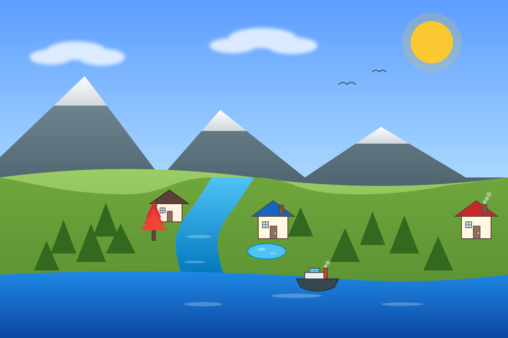{.landscape-svg}

`280e899` — Add ship on ocean

---

## How Do We Merge This?

::: columns
::: column
**`main`**

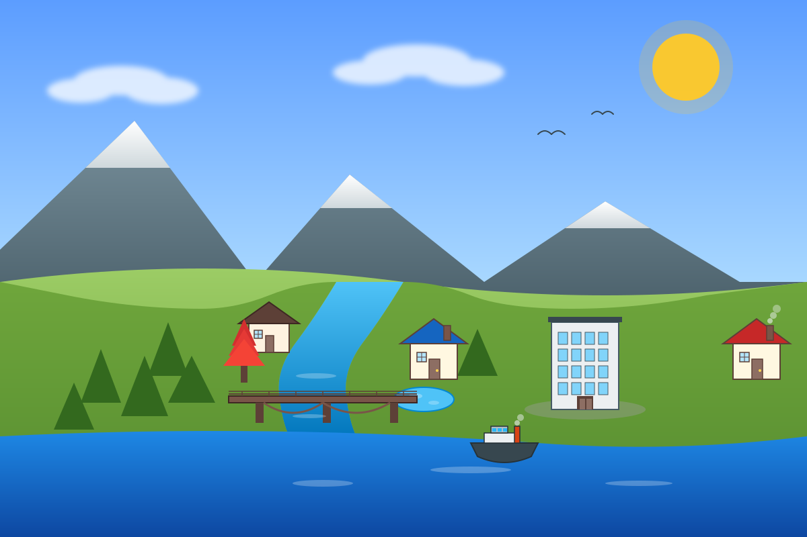{.landscape-svg}

`6c20659` — Multi-story office building
:::

::: column
**`car-park-road`**

{.landscape-svg}

`fa941eb` — Car park and road
:::
:::

---

## What is a Merge Conflict?

::: {.small-text}
A **merge conflict** happens when Git cannot automatically combine two branches because they edited the same part of a file.

In real development, this often happens when:

- Two developers edit the same function
- One person renames a file while another changes its contents
- A feature branch and `main` both update the same configuration file

When a conflict occurs, Git gives you three ways to resolve it:

1. **Reject all incoming** — keep the `main` version
2. **Accept all incoming** — keep the incoming branch version
3. **Manual merge** — combine both versions yourself
:::

---

## Policy 1: Reject All Incoming

::: {.small-text}
Keep the `main` version and discard the incoming changes.
:::

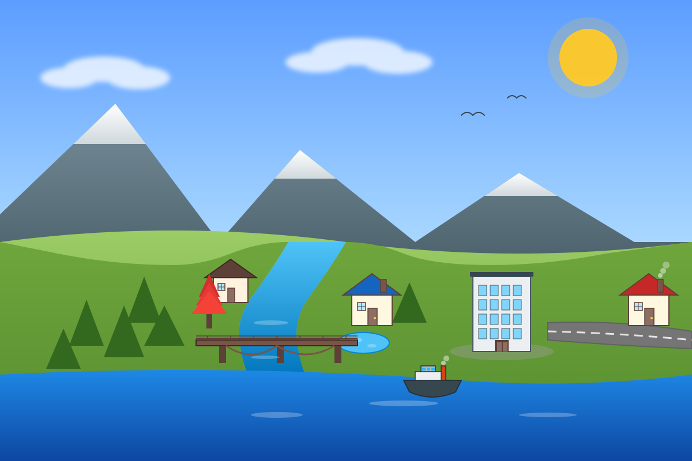{.landscape-svg-large}

::: {.small-text}
`734406d` — Merge branch 'car-park-road' into merge-reject-incoming
:::

---

## Policy 2: Accept All Incoming

::: {.small-text}
Keep the incoming branch version and discard the `main` changes.
:::

{.landscape-svg-large}

::: {.small-text}
`25eba09` — Merge branch 'car-park-road' into merge-accept-incoming
:::

---

## Policy 3: Manual Merge

::: {.small-text}
Combine both versions yourself to get the best of both worlds.
:::

{.landscape-svg-large}

::: {.small-text}
`dfbc161` — Manually resolve merge: office building with surrounding car park
:::

---

## 3 Branch Handling Methods

::: columns
::: {.column style="font-size: 1.3rem;"}
```{mermaid}
%%| fig-width: 3
gitGraph
    commit id: "Base"
    branch feature
    checkout feature
    commit id: "Feature"
    checkout main
    commit id: "Main"
    merge feature id: "Merge"
```

**Direct merge**

Merge the feature branch straight into `main` and resolve conflicts on `main`.
:::

::: {.column style="font-size: 1.3rem;"}
```{mermaid}
%%| fig-width: 3
gitGraph
    commit id: "Base"
    branch feature
    checkout feature
    commit id: "Feature"
    checkout main
    commit id: "Main"
    checkout feature
    merge main id: "Merge main"
    checkout main
    merge feature id: "Merge feature"
```

**Merge `main` into feature first**

Keep the feature branch up to date, resolve conflicts there, then merge back into `main`.
:::

::: {.column style="font-size: 1.3rem;"}
```{mermaid}
%%| fig-width: 3
gitGraph
    commit id: "Base"
    branch feature
    checkout feature
    commit id: "Feature"
    checkout main
    commit id: "Main"
    branch sandbox
    checkout sandbox
    merge feature id: "Sandbox merge"
    checkout main
    merge sandbox id: "Merge sandbox"
```

**Sandbox branch**

Create a temporary branch for the merge, resolve conflicts in the sandbox, then merge it into `main`.
:::
:::

---

## Recap

::: {.small-text}
| Concept | What it does | Analogy |
|---------|--------------|---------|
| **Commit** | Save a snapshot of your code | Quicksave |
| **Checkout** | Return to a previous snapshot | Load game |
| **Branch** | Work on a parallel timeline | Parallel save slot |
| **Merge** | Combine two timelines | Combine save files |
| **Cherry-pick** | Copy one snapshot elsewhere | Copy one save point |
| **Merge policy** | Choose which version to keep | Decide which build to keep |
| **Branch handling method** | Choose where to perform the merge | Pick a safe place to combine |
:::

