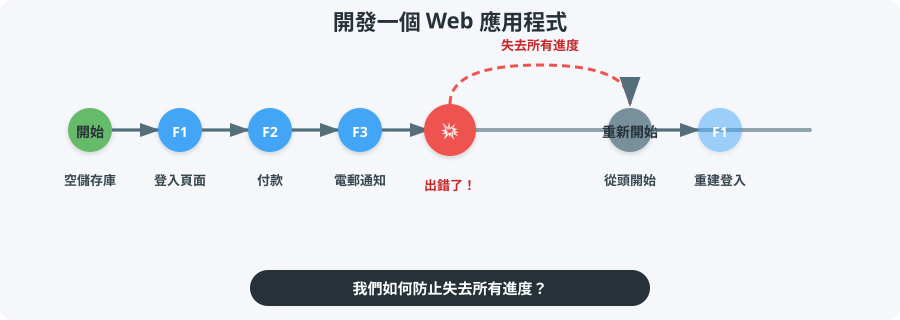
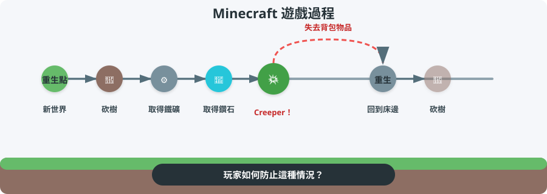
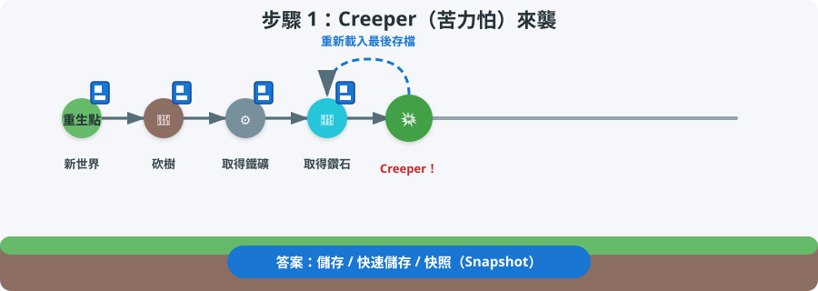
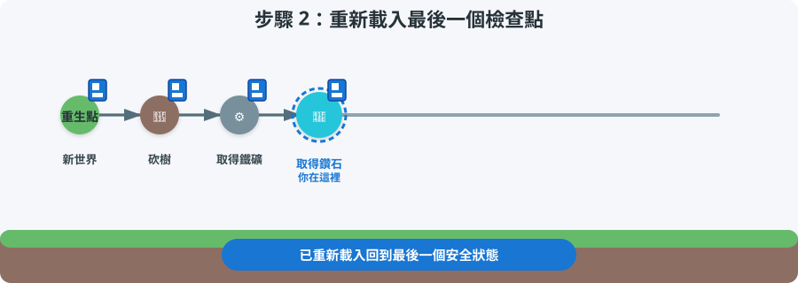
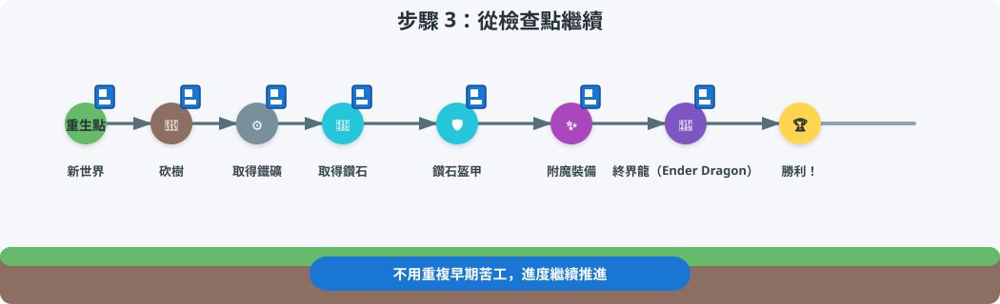
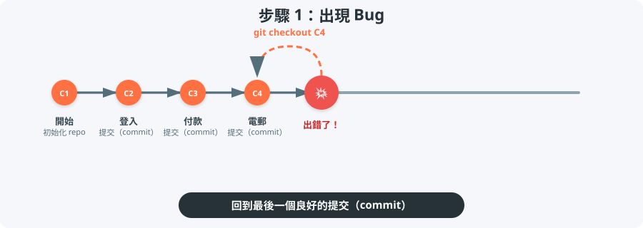
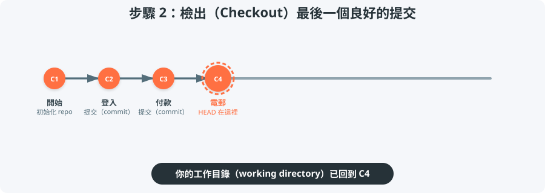
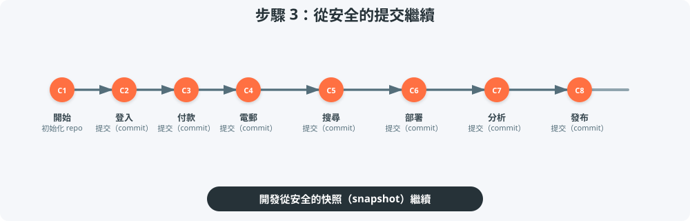

## 開發的惡夢



---

## 熟悉的遊戲情境



---

## 答案：使用 Checkpoint！



---

## 重新載入檢查點



---

## 從檢查點繼續



::: {.callout}
**核心概念：** 檢查點讓你回到安全狀態，不必重頭開始就能繼續遊玩。
:::

---

## Git = 程式碼的檢查點



每個 Git **提交（commit）** 都是你專案的一個**快照（snapshot）**。


---

## 檢出（Checkout）最後一個良好的提交



---

## 繼續開發



::: {.callout}
**核心概念：** Git 提交（commit）是可以返回、比較並繼續發展的快照（snapshot）。
:::

---

## 我們的示範：風景場景

我們會用這個風景場景來解釋 Git。每個提交（commit）都會在場景中新增或修改一些東西。

{.landscape-svg}

---

## 我們的示範儲存庫（Repository）

我們會探索一個建立這個風景場景的小型儲存庫（repo）。

```{mermaid}
%%| fig-width: 10
%%{init: {'theme': 'base', 'themeVariables': { 'git0': '#ff7043', 'git1': '#42a5f5', 'git2': '#66bb6a', 'git3': '#ab47bc' }}}%%
gitGraph
    commit id: "Base landscape"
    commit id: "Add house"
    commit id: "Add red tree"
    branch opposite-house
    checkout opposite-house
    commit id: "House opposite river"
    checkout main
    commit id: "House behind tree"
    merge opposite-house id: "Merge opposite-house"
    branch tower-and-ship
    checkout tower-and-ship
    commit id: "Antenna tower"
    commit id: "Ship on ocean TS"
    checkout main
    commit id: "Add pond"
    cherry-pick id: "Ship on ocean TS"
    commit id: "Construction site"
    branch car-park-road
    checkout car-park-road
    commit id: "Car park + road"
    checkout main
    commit id: "Bridge"
    commit id: "Office building"
    branch merge-accept-incoming
    checkout merge-accept-incoming
    merge car-park-road id: "Accept incoming"
    checkout main
    branch merge-reject-incoming
    checkout merge-reject-incoming
    merge car-park-road id: "Reject incoming"
    checkout main
    branch merge-manual-resolve
    checkout merge-manual-resolve
    merge car-park-road id: "Manual merge"
    checkout main
    merge merge-manual-resolve id: "Merge manual resolve"
```

---

### 提交（Commit）實際操作

::: slide-iframe-wrapper
<iframe src="assets/html/linear_history.html"></iframe>
:::

[在新分頁開啟時間線](assets/html/linear_history.html){target="_blank" .iframe-link}

---

## 設計兩難

::: columns
::: column
**目前狀態**

{.landscape-svg}

`8d1987f` — House behind red tree
:::

::: column
::: {.small-text}
**如果……**

- 我想嘗試把房子放在河的**對岸**？
- 我移動了它，然後覺得放在樹後面**比較好看**？
- 我如何在實驗的同時**不會失去**目前版本？
:::
:::
:::

---

## 什麼是 Git 分支（Branch）？

::: mermaid-large
```{mermaid}
%%| fig-width: 10
%%{init: {'theme': 'base', 'themeVariables': { 'git0': '#ff7043', 'git1': '#42a5f5' }}}%%
gitGraph
    commit id: "Base landscape"
    commit id: "Add house"
    commit id: "Add red tree"
    branch opposite-house
    checkout opposite-house
    commit id: "House opposite river"
    checkout main
    commit id: "House behind tree"
```
:::

**分支（branch）** 是從特定提交（commit）開始的獨立時間線。你可以自由實驗，同時原本的分支保持不變。

---

### 分支（Branch）實際操作

::: slide-iframe-wrapper
<iframe src="assets/html/branch_demo.html"></iframe>
:::

[在新分頁開啟分支示範](assets/html/branch_demo.html){target="_blank" .iframe-link}

---

## 真實專案中的分支

::: mermaid-large
```{mermaid}
%%| fig-width: 10
%%{init: {'theme': 'base', 'themeVariables': { 'git0': '#ff7043', 'git1': '#42a5f5' }}}%%
gitGraph
    commit id: "Initial setup"
    commit id: "User login"
    branch feature/payment
    checkout feature/payment
    commit id: "Payment form"
    commit id: "Stripe integration"
    checkout main
    commit id: "Dashboard"
    branch bugfix/login-error
    checkout bugfix/login-error
    commit id: "Fix auth bug"
    checkout main
```
:::

在真實開發中，你可以為了開發功能、修正錯誤或嘗試**重構（refactor）**而建立分支，而且這些都可以同時進行。

---

## 如果我們想要兩間房子都保留？

::: columns
::: column


:::

::: column
::: {.small-text}
現在我們有兩個版本的房子。我們應該：

- 在 `main` 上重建，失去樹後版本？
- 在 `opposite-house` 上重建，失去原本版本？
- **合併（Merge）** 它們，讓兩間房子一起出現？
:::
:::
:::

---

## 合併（Merge）：結合時間線

::: mermaid-large
```{mermaid}
%%| fig-width: 10
%%{init: {'theme': 'base', 'themeVariables': { 'git0': '#ff7043', 'git1': '#42a5f5' }}}%%
gitGraph
    commit id: "Base landscape"
    commit id: "Add house"
    commit id: "Add red tree"
    branch opposite-house
    checkout opposite-house
    commit id: "House opposite river"
    checkout main
    commit id: "House behind tree"
    merge opposite-house id: "Merge opposite-house" type: HIGHLIGHT
```
:::

**合併（merge）** 會把兩個分支重新結合。

---

### 合併（Merge）實際操作

::: slide-iframe-wrapper
<iframe src="assets/html/merge_demo.html"></iframe>
:::

[在新分頁開啟合併示範](assets/html/merge_demo.html){target="_blank" .iframe-link}

---

## 真實專案中的合併

::: mermaid-large
```{mermaid}
%%| fig-width: 10
%%{init: {'theme': 'base', 'themeVariables': { 'git0': '#ff7043', 'git1': '#42a5f5' }}}%%
gitGraph
    commit id: "Initial setup"
    commit id: "User login"
    branch feature/payment
    checkout feature/payment
    commit id: "Payment form"
    commit id: "Stripe integration"
    checkout main
    commit id: "Dashboard"
    merge feature/payment id: "Merge payment"
```
:::

在真實開發中，當功能分支（feature branch）準備好時，你會將它**合併（merge）**回 `main`。

---

## 合併結果

{.landscape-svg}

`46130e9` — Merge branch 'opposite-house'

---

## 如果我們只想要一個變更？

::: columns
::: column
**`tower-and-ship` 分支**

{.landscape-svg}

`b5580ac` — Add ship on ocean
:::

::: column
::: {.small-text}
**目前的 `main`**

- `46130e9` — Merge branch 'opposite-house'
- `d1cd048` — Add pond

如果我們只想要 `main` 上有「海上的船」這個變更，但不想合併整個 `tower-and-ship` 分支呢？
:::
:::
:::

---

## Cherry-Pick：複製一個提交

::: mermaid-large
```{mermaid}
%%| fig-width: 10
%%{init: {'theme': 'base', 'themeVariables': { 'git0': '#ff7043', 'git1': '#66bb6a' }}}%%
gitGraph
    commit id: "Merge opposite-house"
    branch tower-and-ship
    checkout tower-and-ship
    commit id: "Antenna tower"
    commit id: "Ship on ocean"
    checkout main
    commit id: "Add pond"
    cherry-pick id: "Ship on ocean"
```
:::

**Cherry-pick** 會把單一**提交（commit）**從一個分支複製到另一個分支，而不需要**合併（merge）**整個分支。

::: {.callout}
當你只想要一個錯誤修正（bug-fix）或功能，而不是整個分支時，使用 cherry-pick。
:::

---

### Cherry-Pick 實際操作

::: slide-iframe-wrapper
<iframe src="assets/html/cherry_pick_demo.html"></iframe>
:::

[在新分頁開啟 cherry-pick 示範](assets/html/cherry_pick_demo.html){target="_blank" .iframe-link}

---

## 真實專案中的 Cherry-Pick

::: mermaid-large
```{mermaid}
%%| fig-width: 10
%%{init: {'theme': 'base', 'themeVariables': { 'git0': '#ff7043', 'git1': '#66bb6a' }}}%%
gitGraph
    commit id: "v1.0 release"
    branch feature-search
    checkout feature-search
    commit id: "Search UI"
    commit id: "Fix search crash"
    checkout main
    cherry-pick id: "Fix search crash"
```
:::

在真實開發中，你可以從功能分支（feature branch）**挑選（cherry-pick）**單一錯誤修正提交（bug-fix commit）到發布分支（release branch）。

---

## Cherry-Pick 的結果

{.landscape-svg}

`280e899` — Add ship on ocean

---

## 我們如何合併這個？

::: columns
::: column
**`main`**

{.landscape-svg}

`6c20659` — Multi-story office building
:::

::: column
**`car-park-road`**

{.landscape-svg}

`fa941eb` — Car park and road
:::
:::

---

## 什麼是合併衝突（Merge Conflict）？

::: {.small-text}
當 Git 無法自動結合兩個分支，因為它們修改了同一個檔案的相同部分時，就會發生**合併衝突（merge conflict）**。

在真實開發中，這經常發生在：

- 兩位開發者修改同一個**函式（function）**
- 一個人重新命名檔案，同時另一個人修改了檔案內容
- 功能分支（feature branch）和 `main` 都更新了同一個設定檔

發生衝突時，Git 提供三種解決方式：

1. **拒絕所有傳入變更** — 保留 `main` 版本
2. **接受所有傳入變更** — 保留傳入分支版本
3. **手動合併** — 自己結合兩個版本
:::

---

## 策略 1：拒絕所有傳入變更

::: {.small-text}
保留 `main` 版本，捨棄傳入的變更。
:::

{.landscape-svg-large}

::: {.small-text}
`734406d` — Merge branch 'car-park-road' into merge-reject-incoming
:::

---

## 策略 2：接受所有傳入變更

::: {.small-text}
保留傳入分支版本，捨棄 `main` 的變更。
:::

{.landscape-svg-large}

::: {.small-text}
`25eba09` — Merge branch 'car-park-road' into merge-accept-incoming
:::

---

## 策略 3：手動合併

::: {.small-text}
自己結合兩個版本，以取得兩全其美的結果。
:::

{.landscape-svg-large}

::: {.small-text}
`dfbc161` — Manually resolve merge: office building with surrounding car park
:::

---

## 三種分支處理方式

::: columns
::: {.column style="font-size: 1.3rem;"}
```{mermaid}
%%| fig-width: 3
gitGraph
    commit id: "Base"
    branch feature
    checkout feature
    commit id: "Feature"
    checkout main
    commit id: "Main"
    merge feature id: "Merge"
```

**直接合併（Direct merge）**

直接將功能分支（feature branch）**合併（merge）**到 `main`，並在 `main` 上解決衝突。
:::

::: {.column style="font-size: 1.3rem;"}
```{mermaid}
%%| fig-width: 3
gitGraph
    commit id: "Base"
    branch feature
    checkout feature
    commit id: "Feature"
    checkout main
    commit id: "Main"
    checkout feature
    merge main id: "Merge main"
    checkout main
    merge feature id: "Merge feature"
```

**先將 `main` 合併到功能分支**

讓功能分支保持最新，在那裡解決衝突，然後再合併回 `main`。
:::

::: {.column style="font-size: 1.3rem;"}
```{mermaid}
%%| fig-width: 3
gitGraph
    commit id: "Base"
    branch feature
    checkout feature
    commit id: "Feature"
    checkout main
    commit id: "Main"
    branch sandbox
    checkout sandbox
    merge feature id: "Sandbox merge"
    checkout main
    merge sandbox id: "Merge sandbox"
```

**沙盒分支（Sandbox branch）**

建立一個臨時分支來進行合併，在**沙盒（sandbox）**中解決衝突，然後再合併到 `main`。
:::
:::

---

## 重點回顧

::: {.small-text}
| 概念 | 作用 | 類比 |
|---------|--------------|---------|
| **提交（Commit）** | 儲存程式碼的快照（snapshot） | 快速存檔（Quicksave） |
| **檢出（Checkout）** | 回到先前的快照（snapshot） | 載入遊戲 |
| **分支（Branch）** | 在平行時間線上工作 | 平行存檔欄位 |
| **合併（Merge）** | 結合兩條時間線 | 合併存檔檔案 |
| **挑選（Cherry-pick）** | 把單一快照複製到別處 | 複製單一存檔點 |
| **合併策略（Merge policy）** | 選擇保留哪個版本 | 決定保留哪個版本 |
| **分支處理方式（Branch handling method）** | 選擇在哪裡執行合併 | 挑選一個安全的地方來結合 |
:::

