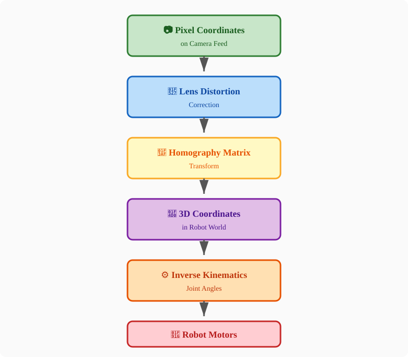
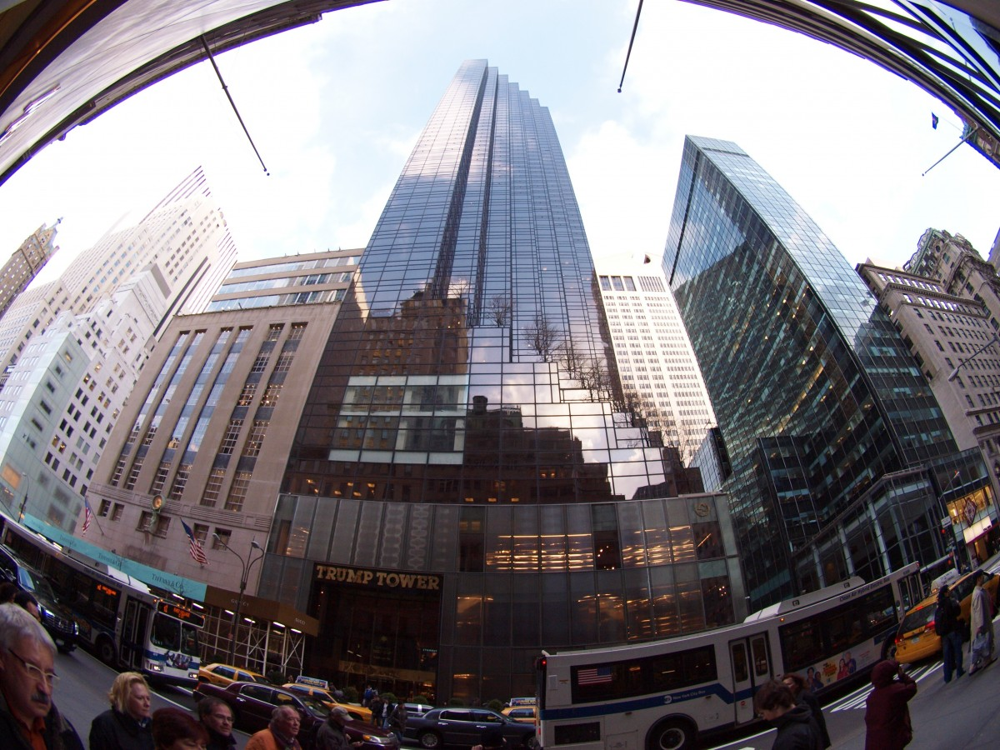
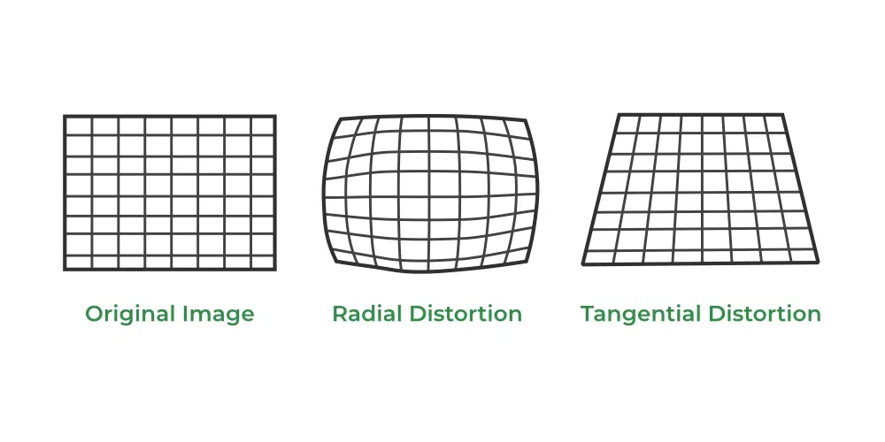
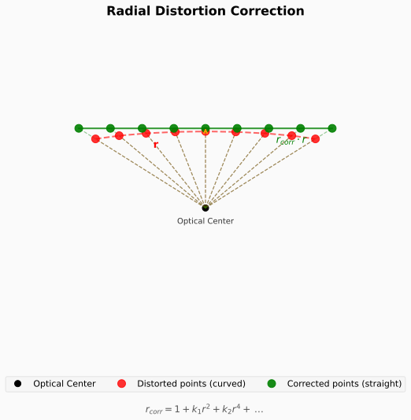
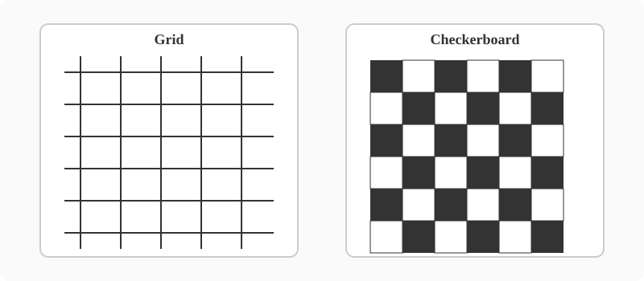
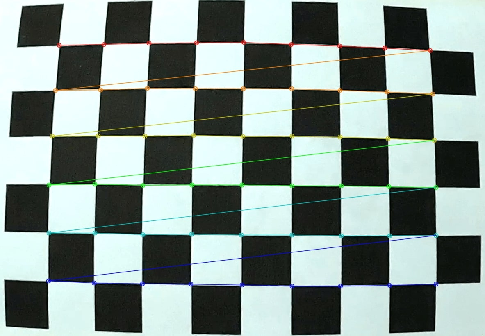
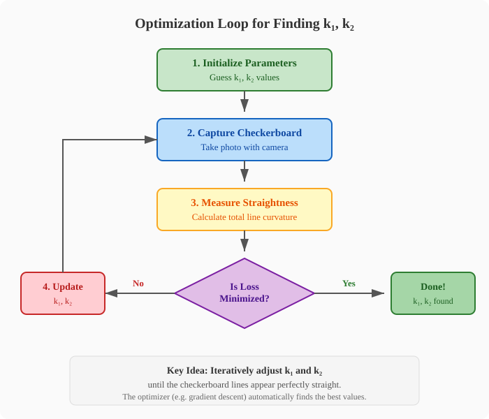
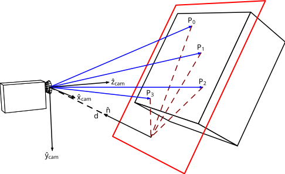
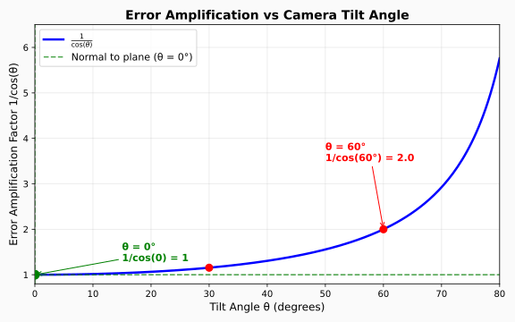

## Lesson Overview {.smaller-text}

In this lesson, we will cover three key topics to build a **click-to-pick** pipeline:

1. **Lens Distortion Correction** 📷
   - Correcting camera lens distortions for accurate pixel coordinates

2. **Homography Matrix** 🎯
   - Transforming 2D camera coordinates into the 3D robot coordinate system

3. **VLM Object Detection** 🧠
   - Using Vision-Language Models to detect and localize objects from natural language instructions

---

## Demo: Click-to-Pick in Action

::: {.video-container}

:::

**In this lesson, you will learn how to build this pipeline yourself!**

---

## Pipeline: From Pixel to Robot Motion

::: {.video-container}
{height="600"}
:::

---

## What is Camera Distortion? {.smaller-text}

Camera lenses introduce geometric distortions that cause straight lines in the real world to appear curved in the image.

::: {.video-container}
{height="450"}
:::

**This affects the accuracy of pixel-to-world coordinate mapping!**

---

## Types of Distortion {.x-small}

There are two main types of lens distortion:

::: {.two-column}
::: {.column}

**1. Radial Distortion**

- Caused by the lens shape
- Points appear stretched or compressed radially from the optical center
- Most significant distortion effect
- **We will focus on correcting this!**

:::

::: {.column}

**2. Tangential Distortion**

- Caused by lens not being perfectly parallel to the image sensor
- Much smaller effect in most setups
- **We can ignore this for our use case**

::: {.callout-note}
We will explain later why tangential distortion can be safely ignored in our setup.
:::

:::
:::

::: {.video-container}
{height="280"}
:::

---

## Types of Radial Distortion {.x-small}

Radial distortion comes in three common forms:

::: {.three-column}
::: {.column}

**Barrel Distortion**

- Straight lines bow outward
- Common in wide-angle lenses

{width="220"}

:::

::: {.column}

**Pincushion Distortion**

- Straight lines bow inward
- Common in telephoto lenses

{width="220"}

:::

::: {.column}

**Mustache Distortion**

- Combination of barrel and pincushion
- Lines bow outward near center, inward near edges

{width="220"}

:::
:::

---

## Visualizing Radial Distortion Correction {.smaller-text}

::: {.video-container}
{height="500"}
:::

---

## Radial Distortion Model {.x-small}

We model radial distortion using a polynomial with coefficients **k₁, k₂, k₃, ...**

Given a distorted normalized point $(x_d, y_d)$, we compute the radial distance:

$$r^2 = x_d^2 + y_d^2$$

The distortion correction factor is:

$$r_{corr} = 1 + k_1 r^2 + k_2 r^4 + k_3 r^6 + \dots$$

The undistorted coordinates are then:

$$x_u = x_d \cdot r_{corr}$$
$$y_u = y_d \cdot r_{corr}$$

::: {.callout-note}
For most lenses, using only **k₁** and **k₂** is sufficient. Higher-order terms (k₃, ...) are only needed for fisheye lenses.
:::

---

## Finding Correction Parameters {.smaller-text}

To find the distortion coefficients, we need a reference object with known straight lines.

::: {.two-column}
::: {.column}

A **checkerboard** or **grid pattern** is ideal because:

- It has many straight lines at known angles
- Easy to manufacture and print
- Distortion is clearly visible on the edges

:::

::: {.column}

::: {.video-container}
{height="350"}
:::

:::
:::

---

## Method 1: Manual Tuning {.smaller-text}

The simplest approach is to manually adjust **k₁** and **k₂** until the camera feed looks correct.

**How it works:**

1. Place a checkerboard in front of the camera
2. Display the live camera feed
3. Adjust **k₁** and **k₂** sliders in real-time
4. Stop when the curved lines appear straight

::: {.callout-warning}
This method is time-consuming and requires trial-and-error. It also depends on human judgment of "straightness."
:::

---

## Demo: Manual Parameter Tuning

::: {.video-container}

:::

**Watch how adjusting k₁ and k₂ straightens the curved lines.**

---

## Running the Lens Calibration Server {.x-small}

To try this yourself, open a terminal and run:

```bash
robot3
```

Then select **option 9** — `lens_calibration_server.py`

**Script workflow:**

1. Choose mode: **Calibrate** or view with existing calibration
2. Select your camera from the list
3. Capture an image of the **grid paper**
4. Click the **4 outer corners** (top-left, top-right, bottom-right, bottom-left)
5. Enter the **grid size** (squares horizontal × vertical)
6. Adjust **k₁** and **k₂** sliders until the overlaid grid looks straight
7. **Download** the JSON calibration file

::: {.callout-tip}
Keep this JSON file safe — you'll need it for the homography and click-pick servers!
:::

---

## Method 2: Algorithmic Calibration {.smaller-text}

Modern computer vision can automatically calculate **k₁** and **k₂** from a single checkerboard image.

::: {.two-column}
::: {.column}

**How it works:**

1. Capture an image of the checkerboard
2. Detect where the straight lines are
   - They will appear **curved** before correction
3. Find the parameters that make those lines look **most straight**

:::

::: {.column}

::: {.video-container}
{height="380"}
:::

:::
:::

---

## How to Find Parameters Analytically? {.smaller-text}

**Question:** The equations for radial distortion are non-linear. If the parameters are very difficult to calculate analytically, how should we find them?

**Think back to previous lectures...**

::: {.callout-tip}
### Recall
What approach do we use when we have:

- A target outcome we want to achieve
- Parameters that are hard to solve directly
- A way to measure how "wrong" our current guess is
:::

---

## Answer: Optimization! {.smaller-text}

Just like tuning neural network weights or IK joint angles, we use an **optimization loop** to find the best k₁ and k₂.

::: {.video-container}
{height="520"}
:::

**The optimizer iteratively adjusts k₁ and k₂ to minimize the total line curvature.**

---

## Manual vs. Automatic Calibration {.smaller-text}

| | Manual Tuning 🔧 | Automatic Calibration 🤖 |
|---|---|---|
| **Speed** | ⏱️ Slow (trial & error) | ⚡ Fast (seconds) |
| **Accuracy** | 👁️ Depends on human eye | 📐 Mathematically precise |
| **Setup** | ✅ No extra code needed | 💻 Requires calibration algorithm |
| **Robustness** | ⚠️ Subjective | ✅ Reproducible results |

**Why still keep manual tuning?**

- 🚨 **Debugging:** When auto-calibration fails, manual tuning helps verify the camera works
- 🔧 **Fine-tuning:** Small tweaks by eye can sometimes beat algorithmic results
- 📦 **No dependencies:** Works anywhere without OpenCV or optimization libraries
- 🧠 **Understanding:** Manual adjustment builds intuition for what k₁ and k₂ actually do

::: {.callout-note}
Best practice: Use **automatic calibration** first, then **manually fine-tune** if needed.
:::

---

## Intro to Homography {.smaller-text}

A **homography** is a transformation that maps points from one plane to another.

In robotics vision, it lets us convert **2D pixel coordinates** from the camera into **2D coordinates on the robot's working table**.

::: {.two-column}
::: {.column}

**Why we need it:**

- The camera sees the world in 2D pixels
- The robot lives in a 3D world
- Homography bridges this gap for flat surfaces

:::

::: {.column}

::: {.video-container}
{height="350"}
:::

:::
:::

---

## The Homography Matrix {.smaller-text}

The homography is represented by a **3×3 matrix** $\mathbf{H}$:

$$
\mathbf{H} = \begin{bmatrix} h_{11} & h_{12} & h_{13} \\ h_{21} & h_{22} & h_{23} \\ h_{31} & h_{32} & h_{33} \end{bmatrix}
$$

Given a pixel $(u, v)$, we find its world position $(x, y)$ on the plane:

$$
\begin{bmatrix} x' \\ y' \\ w' \end{bmatrix} = \mathbf{H} \begin{bmatrix} u \\ v \\ 1 \end{bmatrix}
$$

$$x = \frac{x'}{w'}, \quad y = \frac{y'}{w'}$$

**This maps any 2D camera point to a 2D point on the robot's table plane!**

---

## Limitation: Planar Mapping Only {.smaller-text}

Homography can only map between **2D planes**. It does not give us true 3D depth.

::: {.two-column}
::: {.column}

**What homography CAN do:**

- Map any point on the **table surface** to camera pixels
- Track objects lying **flat** on the workspace
- Work perfectly for pick-and-place tasks

:::

::: {.column}

**What it CANNOT do:**

- Tell you the **height** of an object above the table
- Work accurately for objects on **sloped** surfaces
- Handle objects that are **stacked** or floating

:::
:::

::: {.callout-note}
For our SO101 robot, this is fine! We mostly care about where objects are on the **flat working table**.
:::

---

## Finding H with 4 Known Points {.smaller-text}

To compute $\mathbf{H}$, we need **4 known point pairs**:

- 4 points on the **robot table** with known real-world $(x, y)$ coordinates
- The same 4 points visible in the **camera image** at pixel $(u, v)$ coordinates

::: {.video-container}
{height="320"}
:::

**The 4 points should not be collinear** — spread them to the corners of your workspace for best accuracy.

---

## Solving for the Homography Matrix {.x-small}

Each point pair gives two linear equations. With 4 points (8 equations) and 8 unknowns (since $h_{33}=1$), we can solve $\mathbf{H}$.

For one correspondence $(u, v) \leftrightarrow (x, y)$:

$$
x = \frac{h_{11}u + h_{12}v + h_{13}}{h_{31}u + h_{32}v + 1}
$$

$$
y = \frac{h_{21}u + h_{22}v + h_{23}}{h_{31}u + h_{32}v + 1}
$$

Rearranging into linear form $Ah = 0$:

$$
\begin{bmatrix}
-u & -v & -1 & 0 & 0 & 0 & xu & xv & x \\
0 & 0 & 0 & -u & -v & -1 & yu & yv & y
\end{bmatrix}
\begin{bmatrix} h_{11} \\ h_{12} \\ h_{13} \\ h_{21} \\ h_{22} \\ h_{23} \\ h_{31} \\ h_{32} \\ h_{33} \end{bmatrix} = 0
$$

**Solution:** Take the SVD of $A$; the eigenvector for the smallest singular value is $\mathbf{H}$.

---

## Camera Angle Matters {.x-small}

For the most accurate mapping, the camera should look **straight down** at the table (normal to the plane).

**Why?** When the camera is tilted, perspective distortion stretches the image unevenly:

- Points farther from the camera appear closer together
- Small **pixel errors** get amplified into large **position errors**

The error amplification factor grows with tilt angle $\theta$:

$$
\text{Position Error} \approx \frac{\Delta_{pixel}}{\cos(\theta)}
$$

::: {.two-column}
::: {.column}

At $\theta = 0°$ (normal): 1-pixel error stays **1 pixel**

At $\theta = 60°$: 1-pixel error becomes **2× larger**

The closer to normal, the smaller the amplification!

::: {.callout-tip}
**Tip:** Mount your camera as close to overhead as possible for the most stable homography.
:::

:::

::: {.column}

::: {.video-container}
{height="320"}
:::

:::
:::

---

## Demo: Homography Calibration

::: {.video-container}

:::

**Watch how 4 clicked points define the mapping from camera pixels to robot table coordinates.**

---

## Running the Homography Calibration Server {.x-small}

To try this yourself, open a terminal and run:

```bash
robot3
```

Then select **option 10** — `homography_calibration_server.py`

**Script workflow:**

1. Select your **camera** and **white arm**
2. For each of the **4 calibration points**:
   - Arm moves to the point → place a **marker** under the gripper
   - Camera captures an image → **click the marker**
3. Server computes **H** and **H_inv**
4. Live **overlay grid** appears for verification
5. Adjust grid spacing, then **download the JSON**

::: {.callout-tip}
Have the lens calibration JSON ready first — this script uses the undistorted image!
:::

---

## Homography is Not Permanent! {.smaller-text}

**Important:** If anything moves, $\mathbf{H}$ becomes invalid and must be recalculated.

Recalibration is needed when:

- 📷 **Camera position changes** — bumped, nudged, or remounted
- 📐 **Table height changes** — different working surface or mat
- 🔧 **Robot base moves** — the coordinate system shifts
- 📦 **Camera lens swapped** — intrinsics change

::: {.callout-warning}
Always verify your homography before running autonomous pick-and-place!
:::

---

## Why We Can Ignore Tangential Distortion {.smaller-text}

Remember we said tangential distortion could be ignored? Here's why:

**Tangential distortion** is caused by the lens not being perfectly parallel to the image sensor. It creates a small skew in the image.

However, the **homography matrix** already captures the full perspective transformation between the camera plane and the robot's table plane — including any skew or misalignment.

::: {.callout-note}
### Key Insight

The homography $\mathbf{H}$ is flexible enough to absorb both:

- The intended perspective mapping (camera → table)
- The unwanted tangential skew (lens tilt)

So we only need to explicitly correct **radial distortion**; tangential effects get handled automatically when we compute $\mathbf{H}$.
:::

---

## Demo: Click-to-Pick with VLM {.smaller-text}

With distortion correction and homography in place, we can now click anywhere on the camera feed to pick or place objects.

Alternatively, a **Vision-Language Model (VLM)** can automatically create a bounding box to decide where to pick.

::: {.video-container}

:::

---

## Running the Click-Pick Server {.x-small}

To try this yourself, open a terminal and run:

```bash
robot3
```

Then select **option 11** — `click_pick_server.py`

**Prerequisites:**

- Lens calibration JSON (from option 9)
- Homography calibration JSON (from option 10)

**Script workflow:**

1. Select your **camera** and **white arm**
2. **Upload** the lens correction JSON and homography calibration JSON
3. On the control page:
   - **Click anywhere** → arm moves there to pick or drop
   - **Type an instruction** → VLM creates a bounding box for the arm

::: {.callout-note}
Final pipeline: 📷 Camera → 🔧 Undistort → 🎯 Homography → ⚙️ IK → 🤖 Robot
:::

---

## Demo: VLM Picks by Order {.smaller-text}

VLMs understand **text instructions** and can select objects based on spatial relationships.

::: {.video-container}

:::

**Example:** "Pick up the **middle** box" — the VLM correctly identifies which object to grasp.

---

## Demo: VLM Picks by Color {.smaller-text}

VLMs can also filter objects by **color** or other visual attributes described in natural language.

::: {.video-container}

:::

**Example:** "Pick up the **black** pen" — no need to train a separate color detector.

---

## Demo: VLM Specifies Grasp Point {.smaller-text}

A major advantage of VLMs is the ability to target **specific parts** of an object.

::: {.two-column}
::: {.column}

::: {.video-container}

:::

**"Pick from the middle"**

:::

::: {.column}

::: {.video-container}

:::

**"Pick from the handle"**

:::
:::

The VLM boxes only the requested region, letting the gripper grasp optimally.

---

## Why VLM is Replacing Traditional OD {.smaller-text}

Traditional object detectors like **YOLO** can only output predefined classes and bounding boxes. **VLMs** understand context, text, and natural language.

::: {.two-column}
::: {.column}

**What VLM can do that YOLO cannot:**

- Understand text labels and warning signs in the scene
- Follow instructions like "pick the leftmost cup"
- Target specific parts of an object (handle, cap, etc.)
- Work with unseen object classes without retraining

:::

::: {.column}

::: {.video-container}
_looking_at_another_girl(vlm).jpg){height="380"}
:::

:::
:::

---

## Why Traditional Object Detection Still Matters {.smaller-text}

Despite VLM's flexibility, traditional detectors like **YOLO** are still essential:

| | YOLO / Traditional OD | VLM |
|---|---|---|
| **Speed** | ⚡ Real-time (30–100+ FPS) | 🐌 Slow (seconds per frame) |
| **Cost** | ✅ Free, runs locally | 💰 API costs per request |
| **Consistency** | ✅ Deterministic output | ⚠️ Can vary between calls |
| **Internet** | ✅ Offline capable | 📶 Requires network |
| **Setup** | ⚠️ Needs training data | ✅ Zero-shot capability |

**Best practice:** Use **YOLO** for fast, reliable detection of known objects. Use **VLM** when you need flexibility, language understanding, or reasoning about unseen items.

---

## Demo: VLM Safety Failures {.smaller-text}

VLMs are not perfect. They can miss obvious visual cues like warning signs.

::: {.two-column}
::: {.column}

::: {.video-container}

:::

:::

::: {.column}

::: {.video-container}

:::

:::
:::

**Even with a big warning sign, the VLM still wants to pick up the knife!**

This shows the importance of **system prompts** and **safety guardrails**.

---

## 🛠️ Activity: Fix the VLM Prompt {.smaller-text}

The VLM ignored the warning sign because its **system prompt** did not include safety instructions.

**Your task:**

1. Open the VLM system prompt in `~/IN097-phase2c/click_pick_server.py`
2. Add a rule that tells the VLM to **never pick up objects with warning signs** near them
3. **Restart** the click-pick server so the new prompt takes effect
4. Test your modified prompt with the knife scene

::: {.callout-tip}
### Example Prompt Addition

> "If you see a warning sign near an object, do not pick it up. Prioritize safety over task completion."

:::

**Discussion:** What other safety rules should the robot follow?

---

## Where to Edit the System Prompt {.x-small}

Open `~/IN097-phase2c/click_pick_server.py` and find `_VLM_SYSTEM_PROMPT` (around line 84):

```python
_VLM_SYSTEM_PROMPT = """\
You are a precise computer vision assistant. When given an image and an object to locate, you must return a JSON object with the bounding box coordinates.

The bounding box must be in normalized coordinates (0.0 to 1.0), where:
- 0.0,0.0 is the top-left corner
- 1.0,1.0 is the bottom-right corner

Respond ONLY in valid JSON format with no markdown formatting:
{"bbox": [x_min, y_min, x_max, y_max]}

If the object is not found, return: {"bbox": null}
"""
```

Add your safety rule inside the prompt string before the closing `"""`.

---

## Lesson Summary {.x-small}

Today you learned the full **click-to-pick pipeline** for the SO101 robot arm:

### 1. Lens Distortion Correction 📷

- Radial distortion curves straight lines
- Corrected using $r_{corr} = 1 + k_1r^2 + k_2r^4 + \dots$
- Found via manual tuning or automatic optimization with a checkerboard

### 2. Homography Matrix 🎯

- Maps 2D camera pixels to 2D robot table coordinates
- Computed from 4 known point pairs
- Absorbs tangential distortion automatically
- Must be recalibrated if camera or table moves

### 3. VLM Object Detection 🧠

- Understands natural language instructions
- Can pick by order, color, or specific parts
- Faster to set up than traditional detectors, but slower and less consistent
- System prompts are critical for safety

**Final pipeline:** 📷 Camera → 🔧 Undistort → 🎯 Homography → ⚙️ IK → 🤖 Robot
