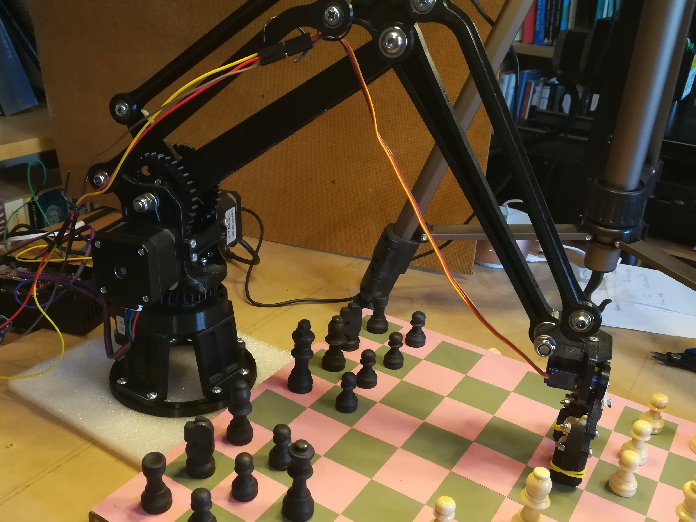
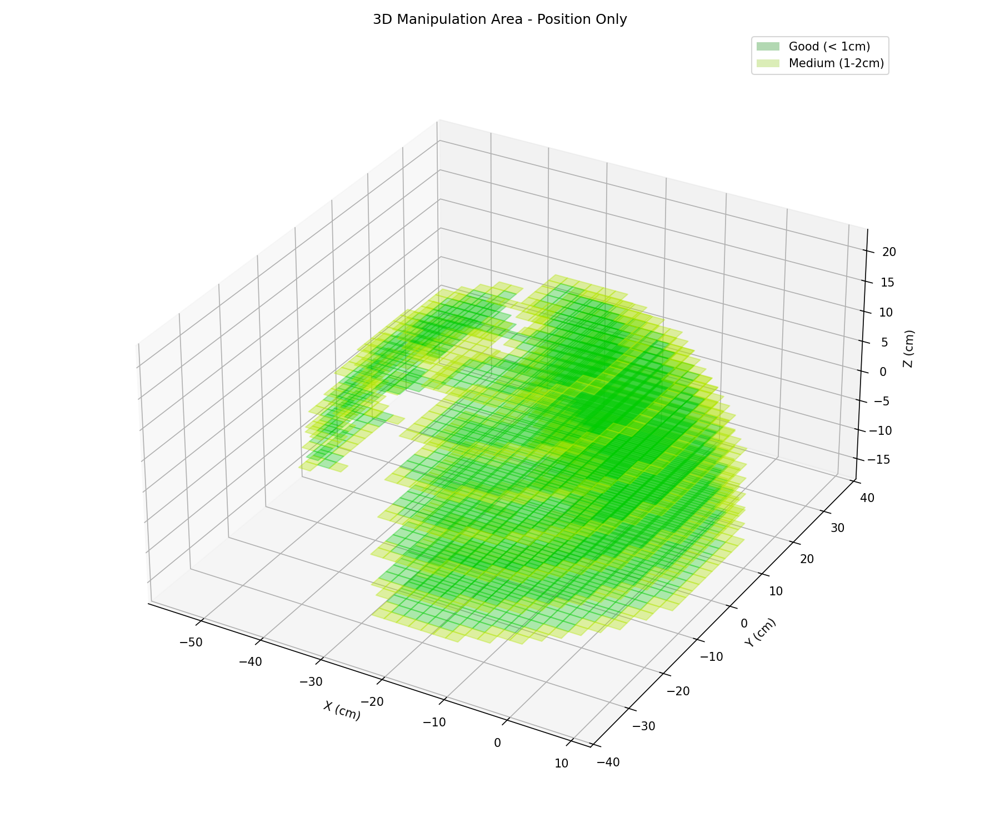
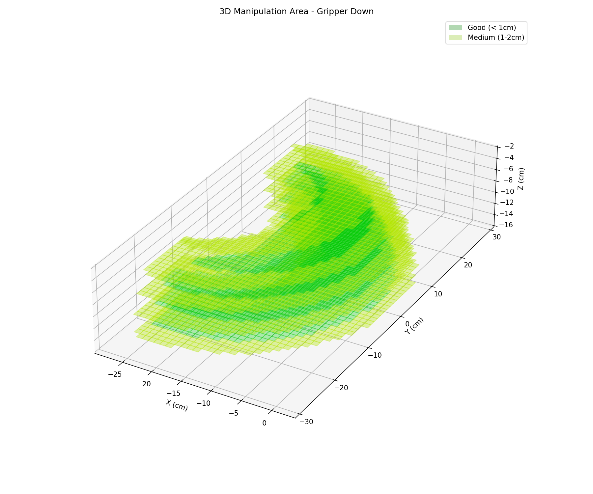
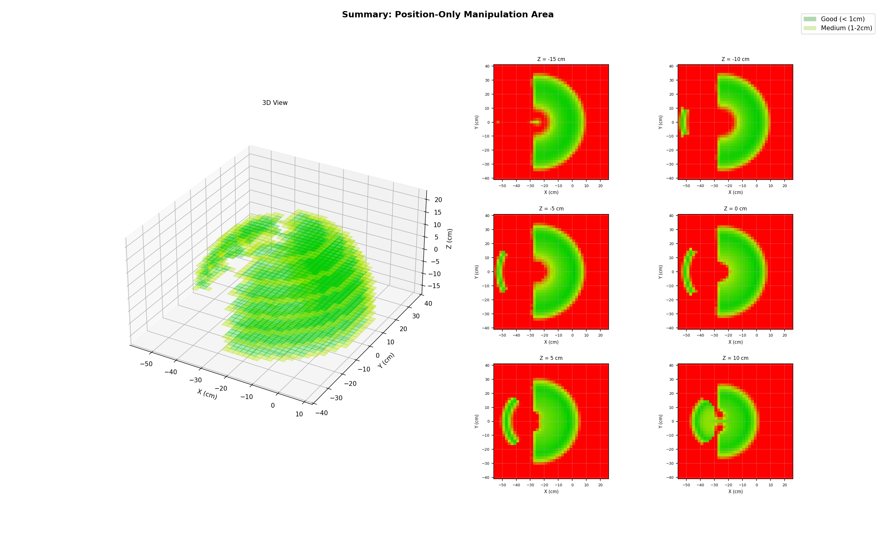
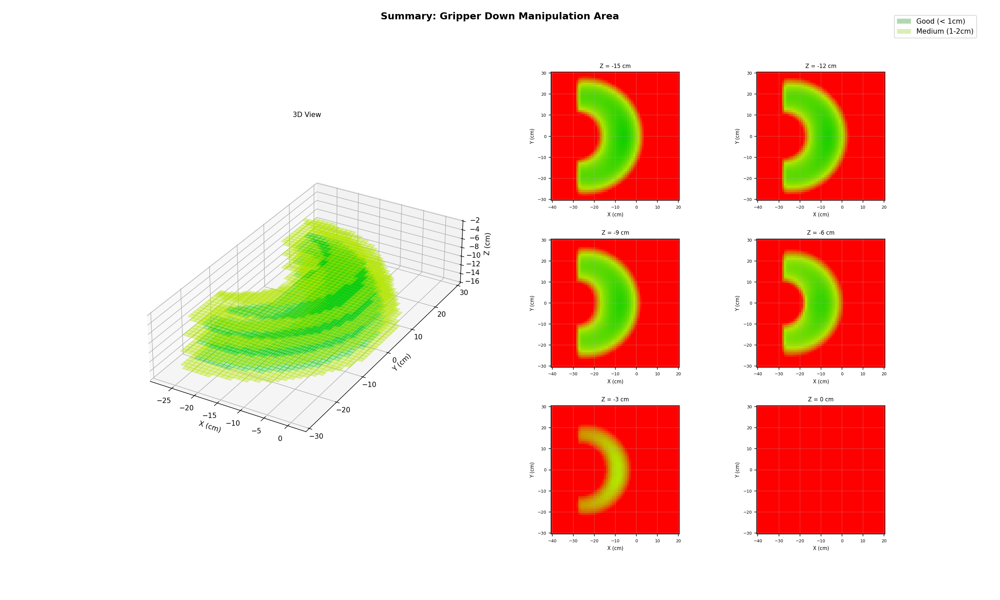
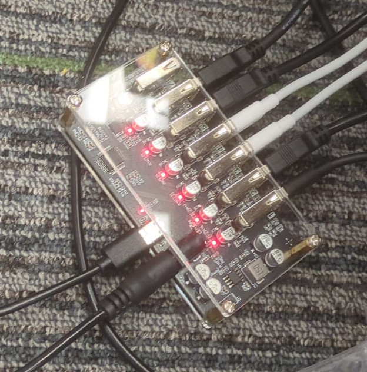

## Lesson 5 — Inverse Kinematics in Depth

---

## What You Will Learn {.smaller-text}

By the end of this lesson you will understand:

- **What Inverse Kinematics (IK) is** — how we command a robot by specifying a target position instead of individual joint angles

- **Analytical vs. Iterative IK** — the difference between closed-form geometry and step-by-step numerical solvers

- **Using IK on the SO-101** — how to perform a simple task such as picking up an object from a fixed location by giving the arm a target coordinate

---

## Quick Recap: The Demo from Lesson 1 {.smaller-text}

In Lesson 1 we saw that IK lets us skip manual joint control.

Instead of saying *"rotate shoulder 30°, elbow 45°..."*, we simply say *"go to (x, y, z)"* and the math figures out the angles for us.

::: {.callout-note}
### Lesson 1 Interactive Demo
Play with a 3-DOF arm to remind yourself how IK feels:
[IK Demo Visualization](https://r121p.github.io/static_resources/robot_arm_scene.html)
:::

---

## Interactive Demo: 2-Joint 2-Link Arm {.smaller-text}

Drag the red circle to set a target and watch the arm follow.

<iframe src="ik_demo.html" width="100%" height="520" style="border:2px solid #333; border-radius:8px;"></iframe>

<p style="text-align:center; margin-top:0.5rem;">
<a href="ik_demo.html" target="_blank">Open demo in full page ↗</a>
</p>

---

## The Solving Equations {.tiny-text}

For a 2-DOF planar arm the equations are compact.  
Keep these in mind — we will compare them to the much larger systems used for 3-D and redundant arms later.

Given target $(x, y)$ and link lengths $L_1$, $L_2$:

**Distance to target:**
$$d^2 = x^2 + y^2$$

**Law of Cosines gives $\theta_2$:**
$$\cos(\theta_2) = \frac{d^2 - L_1^2 - L_2^2}{2 L_1 L_2}$$

**Two-argument arctangent gives $\theta_1$:**
$$\theta_1 = \text{atan2}(y, x) - \text{atan2}\big(L_2 \sin(\theta_2),\; L_1 + L_2 \cos(\theta_2)\big)$$

::: {.callout-tip}
These three lines solve the arm exactly.
When we add more joints, orientation constraints, or 3-D targets, the equations grow far more complicated — which is why robots like the SO-101 switch to iterative (numerical) solvers.
:::

---

## Interactive Demo: 3-Joint 3-Link Arm with Orientation {.smaller-text}

Drag red circle = position, green handle = orientation $\phi$.

<iframe src="ik_demo_3dof.html" width="100%" height="520" style="border:2px solid #333; border-radius:8px;"></iframe>

<p style="text-align:center; margin-top:0.5rem;">
<a href="ik_demo_3dof.html" target="_blank">Open demo in full page ↗</a>
</p>

---

## The Solving Equations — 3 Joints with Orientation {.tiny-text}

Adding one link and an orientation constraint already makes the solution multi-step.

Given target $(x, y)$, target orientation $\phi$, and link lengths $L_1$, $L_2$, $L_3$:

**Step 1 — Back out the last link to find the wrist center:**
$$x_w = x - L_3 \cos(\phi) \quad\quad y_w = y - L_3 \sin(\phi)$$

**Step 2 — Solve the 2-link IK for the wrist center (same equations as before):**
$$d^2 = x_w^2 + y_w^2 \quad\quad \cos(\theta_2) = \frac{d^2 - L_1^2 - L_2^2}{2 L_1 L_2}$$
$$\theta_1 = \text{atan2}(y_w, x_w) - \text{atan2}\big(L_2 \sin(\theta_2),\; L_1 + L_2 \cos(\theta_2)\big)$$

**Step 3 — Enforce the orientation constraint:**
$$\theta_3 = \phi - \theta_1 - \theta_2$$

::: {.callout-tip}
Compare with the 2-joint case:

- We now need a **decomposition trick** (wrist center)
- We have **two separate solving stages** instead of one
- Adding more joints or 3-D targets makes closed-form solutions impractical — which is why real arms use **numerical IK**
:::

---

## In Real Life: Joints Have Angle Limits {.tiny-text}

Real joints have **hard stops**. If a target needs an angle outside the allowed range, the arm **cannot reach it**.

::: {.two-column}
::: {.column}

{width="100%"}

:::

::: {.column}

{width="100%"}

:::
:::

---

## Interactive Demo: 3-Joint Arm with Angle Limits {.tiny-text}

Green sectors = allowed ranges. Drag inside → arm follows. Drag outside → arm **hits limit** and misses.

<iframe src="ik_demo_3dof_limited.html" width="100%" height="520" style="border:2px solid #333; border-radius:8px;"></iframe>

<p style="text-align:center; margin-top:0.5rem;">
<a href="ik_demo_3dof_limited.html" target="_blank">Open demo in full page ↗</a>
</p>

---

## The Solving Equations — With Joint Limits {.tiny-text}

With limits, the tidy closed-form breaks down. Here is what $\text{FK}(\theta_1, \theta_2, \theta_3)$ actually looks like for a 3-link planar arm:

$$x = L_1 \cos(\theta_1) + L_2 \cos(\theta_1 + \theta_2) + L_3 \cos(\theta_1 + \theta_2 + \theta_3)$$
$$y = L_1 \sin(\theta_1) + L_2 \sin(\theta_1 + \theta_2) + L_3 \sin(\theta_1 + \theta_2 + \theta_3)$$
$$\phi = \theta_1 + \theta_2 + \theta_3$$

Now we must solve:

$$\min_{\theta_1, \theta_2, \theta_3} \; \big\|\, \text{FK}(\theta) - \text{target} \,\big\|^2 \quad \text{subject to} \quad \theta_{i,\min} \leq \theta_i \leq \theta_{i,\max}$$

::: {.callout-tip}
Analytical IK gives exact answers in one shot.
Joint limits force us into iterative numerical solvers — exactly what the SO-101 uses in practice.
:::

---

## Degrees of Freedom in 2D {.smaller-text}

A rigid object moving in a plane has **3 DOF**.

<iframe src="dof_2d_demo.html" width="100%" height="420" style="border:2px solid #333; border-radius:8px;"></iframe>

---

## Degrees of Freedom in 3D {.smaller-text}

A rigid object moving in space has **6 DOF** — 3 for position and 3 for orientation.

<iframe src="dof_3d_demo.html" width="100%" height="500" style="border:2px solid #333; border-radius:8px;"></iframe>

---

## Why Analytical IK Fails on the SO-101 {.tiny-text}

The SO-101 arm has **5 controllable joints** (plus the gripper).

To place an object in 3-D space we need to specify **6 numbers**:

- Position: $x$, $y$, $z$
- Orientation: roll, pitch, yaw

**5 joints < 6 DOF**

We have fewer variables than constraints, so there is **no exact analytical solution** for an arbitrary 6-DOF target. The arm simply cannot produce every possible pose.

::: {.callout-tip}
This is called an **under-actuated** system.
We cannot win by adding more math — the hardware itself does not have enough degrees of freedom.
:::

---

## Iterative Methods to the Rescue {.smaller-text}

When a closed-form solution does not exist, we switch to **iterative (numerical) IK**.

Instead of solving equations directly, the computer:

- Starts with a guess
- Checks how far off it is
- Makes a small improvement
- Repeats until the error is small enough

The result is the **best possible solution** — not perfect, but as close as the hardware allows.

---

## How Iterative Solving Works {.smaller-text}

```{mermaid}
flowchart TD
    A["Initial guess θ (often current pose)"] --> B["Compute error"]
    B --> C{"Error < threshold?"}
    C -->|Yes| D["Done"]
    C -->|No| E["Update θ"]
    E --> B
    C -->|Too many tries| F["Give up"]
```

---

## Position-Only IK: 5 Joints is Enough {.smaller-text}

A full 6-DOF pose is impossible with 5 joints, but **position-only IK is fine**.

If we only care about reaching a point $(x, y, z)$, we need only **3 DOF**.

With 5 joints we have **2 extra degrees of freedom** — the arm is **redundant** for this task. That means:

- Multiple joint configurations can reach the same point
- The solver can pick the one that is smoothest, fastest, or safest
- Iterative methods handle this naturally

---

## Locking Joints for Orientation Control {.smaller-text}

We can **lock the last two joints** to fixed angles and use the remaining joints for position.

This gives us a **partial orientation control**: by choosing the locked angles wisely, we can point the gripper up, down, or sideways.

{height="420"}

---

## Why We Still Prefer Iterative Methods {.smaller-text}

Even when an analytical solution exists, engineers often **still choose iterative IK**.

**Why?**

- **No one wants to derive equations** for every new robot geometry
- **Iterative code is reusable** — change the arm, just change the FK function
- **Adding constraints** (joint limits, obstacles, speed limits) is easy
- **Computers are fast** — hundreds of iterations take milliseconds

::: {.callout-tip}
Analytical IK is great for textbooks.
Iterative IK is what runs on real robots.
:::

---

## Demo: Pick and Place {.smaller-text}

::: {.video-container}
{height="500"}
:::

---

## Use Case: Chess Robot {.smaller-text}

Pick-and-place tasks like this are perfect for **position-only IK**.

::: {.two-column}
::: {.column}

{height="400"}

:::

::: {.column}

The gripper always faces **straight down**.

- Orientation is fixed (roll=0, pitch=−90°, yaw=0)
- We only need to solve for **position** $(x, y, z)$
- This makes IK much easier — even a 5-joint arm can do it reliably

**Why this matters:**

- Chess boards are flat
- Pieces stand upright
- No complex re-orientation needed
:::
:::

---

## Demo: Pick from High Place {.smaller-text}

::: {.video-container}
{height="500"}
:::

---

## Use Case: Shelves and Doors {.smaller-text}

Picking from a high shelf or opening a door requires **more than position**.

- The gripper must approach from a specific angle
- You may need to tilt or rotate to grasp a handle
- Sometimes you need to pull in a direction different from the approach

These tasks push the arm toward its **orientation limits**.

Locking joints or using iterative IK with orientation constraints becomes essential.

---

## Manipulation Area: Where Can the Arm Reach? {.smaller-text}

The manipulation area shows all points the gripper can reach.

::: {.two-column}
::: {.column}

**Position-only workspace**

The arm can reach any point inside this 3-D volume when we do not care about orientation.

{width="100%"}

:::

::: {.column}

**Gripper-down workspace**

When the gripper must face straight down (e.g. picking flat objects), the reachable volume shrinks.

{width="100%"}

:::
:::

---

## Manipulation Area Summaries {.smaller-text}

Side-by-side slices show how constraining orientation removes reachable space.

::: {.two-column}
::: {.column}

{width="100%"}

:::

::: {.column}

{width="100%"}

:::
:::

---

## Full Manipulation Area Image Gallery {.smaller-text}

Click any link to view the full-resolution plot.

**Position-only workspace:**
[3-D view](manipulation_area_plots/manipulation_posonly_3d.png) ·
[Summary](manipulation_area_plots/manipulation_posonly_summary.png) ·
[z = −15](manipulation_area_plots/manipulation_posonly_z-15.png) ·
[z = −10](manipulation_area_plots/manipulation_posonly_z-10.png) ·
[z = −5](manipulation_area_plots/manipulation_posonly_z-5.png) ·
[z = 0](manipulation_area_plots/manipulation_posonly_z0.png) ·
[z = 5](manipulation_area_plots/manipulation_posonly_z5.png) ·
[z = 10](manipulation_area_plots/manipulation_posonly_z10.png) ·
[z = 15](manipulation_area_plots/manipulation_posonly_z15.png) ·
[z = 20](manipulation_area_plots/manipulation_posonly_z20.png) ·
[z = 25](manipulation_area_plots/manipulation_posonly_z25.png)

**Gripper-down workspace:**
[3-D view](manipulation_area_plots/manipulation_down_3d.png) ·
[Summary](manipulation_area_plots/manipulation_down_summary.png) ·
[z = −15](manipulation_area_plots/manipulation_down_z-15.png) ·
[z = −12](manipulation_area_plots/manipulation_down_z-12.png) ·
[z = −9](manipulation_area_plots/manipulation_down_z-9.png) ·
[z = −6](manipulation_area_plots/manipulation_down_z-6.png) ·
[z = −3](manipulation_area_plots/manipulation_down_z-3.png) ·
[z = 0](manipulation_area_plots/manipulation_down_z0.png) ·
[z = 3](manipulation_area_plots/manipulation_down_z3.png) ·
[z = 6](manipulation_area_plots/manipulation_down_z6.png)

---

## Hardware Setup: USB Hub Chain {.smaller-text}

Each group must wire their devices in this exact order:

**Arms + Cameras → USB 2.0 hub → USB 3.0 hub → Server**

::: {.two-column}
::: {.column}

**Rules:**

- Connect arms and cameras **only** to the USB 2.0 hub
- Connect the USB 2.0 hub **only** to the USB 3.0 hub
- Connect the USB 3.0 hub **only** to the server
- **Never** plug arms or cameras directly into the server or the 3.0 hub
- The USB 2.0 hub needs an **external DC power supply**

:::

::: {.column}

{width="90%"}

:::
:::

::: {.callout-warning}
Power the USB 2.0 hub with a **HK plug 220 V → DC converter**.
If the hub is under-powered, arms and cameras will randomly disconnect.
:::

---

## USB Setup: DO {.smaller-text}

```{mermaid}
flowchart LR
    A[🤖 Arm 1] --> U2[USB 2.0 Hub<br/>Group X]
    B[📷 Camera 1] --> U2
    C[🤖 Arm 2] --> U2
    D[📷 Camera 2] --> U2
    U2O[USB 2.0 Hub<br/>Group Y] --> U3
    U2 --> U3[USB 3.0 Hub]
    U3 --> S[🖥️ Server]

    style U2 fill:#c8e6c9,stroke:#2e7d32
    style U2O fill:#c8e6c9,stroke:#2e7d32
    style U3 fill:#fff9c4,stroke:#f9a825
    style S fill:#bbdefb,stroke:#1565c0
```

**Correct chain:** All arms and cameras → USB 2.0 hub → USB 3.0 hub → Server

---

## USB Setup: DON'T {.smaller-text}

```{mermaid}
flowchart LR
    A[🤖 Arm] --> S[🖥️ Server]
    B[📷 Camera] --> U3[USB 3.0 Hub]
    U3 --> S

    style A fill:#ffcdd2,stroke:#c62828
    style B fill:#ffcdd2,stroke:#c62828
    style S fill:#ffcdd2,stroke:#c62828
    style U3 fill:#ffcdd2,stroke:#c62828
```

**Never do this:**

- Never plug arms or cameras directly into the server
- Never plug arms or cameras directly into the USB 3.0 hub
- Never skip the USB 2.0 hub

---

## Arm Assignment {.smaller-text}

Each group receives **4 arms**.

The **last 3 characters of the serial number** are written on each arm. Use these to identify which arm is yours.

**Naming convention:**

- `white_1` / `white_2` — white follower arms
- `black_1` / `black_2` — black leader arms

::: {.callout-note}
Check `~/dev/` on the server — symlinks like `white_1 -> /dev/ttyACM0` are created automatically when the arm is plugged in.
:::

---

## Group — Arm Mapping {.smaller-text}

| Group | white_1 | white_2 | black_1 | black_2 |
|-------|---------|---------|---------|---------|
| g1 | `...088` | `...304` | `...906` | `...437` |
| g2 | `...422` | `...740` | `...358` | `...451` |
| g3 | `...444` | `...108` | `...856` | `...174` |
| g4 | `...219` | `...682` | `...566` | `...849` |

*(Last 3 digits of each arm's iSerial are shown.)*

---

## Connecting to the Server {.smaller-text}

Recap from Lesson 2 — SSH into your group's shared Linux account:

**From macOS / Linux Terminal:**
```bash
ssh username@ip_address
```

**From Windows Terminal / PowerShell:**
```powershell
ssh username@ip_address
```

**Example:**
```bash
ssh so101p2g1@192.168.1.100
```

::: {.callout-tip}
If you set up SSH keys in Lesson 2, you can log in without a password.
Otherwise use the password provided by your tutor.
:::

---

## The robot Command {.smaller-text}

After SSH-ing into the server, type `robot` to launch the menu:

```bash
so101p2g1@server:~$ robot

╔══════════════════════════════════════════════════════════╗
║          SO-100 Robot Arm & Camera Launcher              ║
╚══════════════════════════════════════════════════════════╝

1) arm_control_server.py
2) camera_stream_server.py
3) ik_example_control_arm.py
4) check_dev_usage.sh
5) arm_setup.sh --calibrate

Pick an option (1-5, or q):
```

---

## Feature 1: Arm Calibration {.smaller-text}

**Always calibrate first!**

Uncalibrated arms can jerk, overshoot, or hit mechanical limits.

- Select option **5** from the `robot` menu
- Choose the arm you want to calibrate (e.g. `white_1`)
- Move each joint by hand to its neutral position when prompted
- **You must be physically next to the robot** — do not run this remotely

::: {.callout-warning}
Calibrate **before** you try to move the arm with code or the web UI.
:::

---

## Feature 2: Arm Control Server {.smaller-text}

Select option **1** from the `robot` menu.

A Flask web UI starts with sliders for:

- Arm pose $(x, y, z, roll, pitch, yaw)$
- Gripper opening (0–100)
- Movement duration

The terminal prints a URL with a secret token:

```
 * Arm control URL: http://192.168.1.100:5201/?token=AbC123XyZ...
```

**Copy that URL and paste it into your browser.**

---

## Feature 3: Camera Stream Server {.smaller-text}

Select option **2** from the `robot` menu.

Streams live video from all cameras in your group's `~/dev/` folder.

The terminal prints a URL with a secret token:

```
 * Access with token: http://192.168.1.100:5201/?token=AbC123XyZ...
```

**Copy that URL and paste it into your browser.**

Each group member can open the same link to view the cameras.

> ⚠️ **Reminder:** You can only view cameras connected to your group's own USB hub.

---

## Feature 4: IK Example Demos {.smaller-text}

Select option **3** from the `robot` menu.

Runs pre-built pick-and-place examples using inverse kinematics.

- Choose from several built-in movement patterns
- Watch the arm move automatically
- Use this as a starting point for your own code

---

## Feature 5: Check Device Usage {.smaller-text}

Select option **4** from the `robot` menu.

Shows which processes are currently using arms or cameras.

Useful when you get a "device busy" error — check with your groupmates before killing any process!

---

## Opening the Web UI with the Token {.smaller-text}

Both the **Arm Control Server** and **Camera Stream Server** require a token in the URL.

**What the terminal prints:**

```
 * Arm control URL: http://192.168.1.100:5201/?token=AbC123XyZ...
```

**What you do:**

1. **Select** the URL in the terminal
2. **Ctrl+Click** (or copy-paste) to open it in your browser
3. Share the link with your groupmates — they can all control the arm together

::: {.callout-warning}
### Important reminders

- **Calibrate** the arm **before** trying to move it
- The token is randomly generated each time you start the server
- Without the token, the page will reject you
:::

---

## Your Task: Vibe Code the IK Example {.smaller-text}

Open the example file on the server:

```bash
~/IN097-phase2/ik_example_control_arm.py
```

It already contains working pick-and-place demos. **Modify it** so the arm performs **more actions** — be creative!

**Ideas to try:**

- Pick up from one location, show the object, then place at a third location
- Add a "dance" sequence between pick and place
- Change gripper timing (open earlier / close later)
- Add intermediate waypoints for smoother motion

::: {.callout-tip}
Work together with your group. One person edits, everyone watches the arm move!
:::
