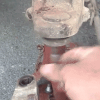
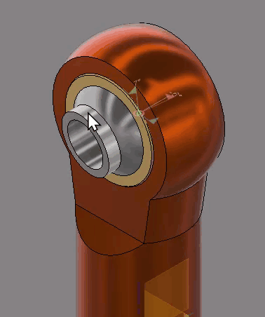
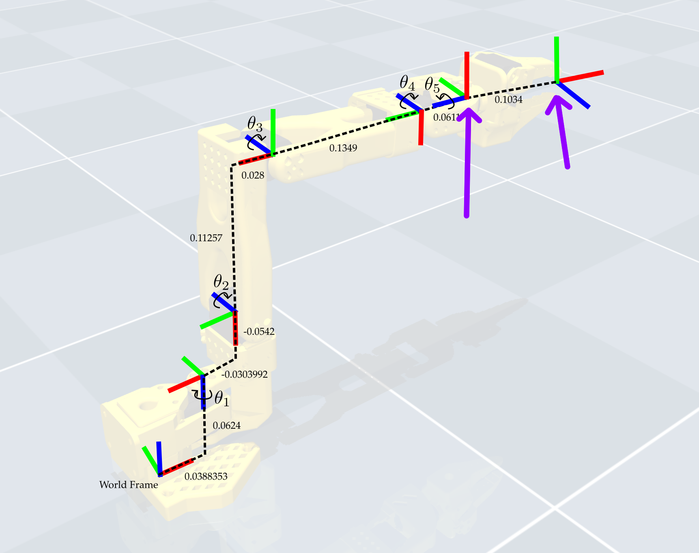

## Lesson 5 — Inverse Kinematics in Depth

---

## What You Will Learn {.smaller-text}

By the end of this lesson you will understand:

- **What Inverse Kinematics (IK) is** — how we command a robot by specifying a target position instead of individual joint angles

- **Analytical vs. Iterative IK** — the difference between closed-form geometry and step-by-step numerical solvers

- **Using IK on the SO-101** — how to perform a simple task such as picking up an object from a fixed location by giving the arm a target coordinate

---

## Quick Recap: The Demo from Lesson 1 {.smaller-text}

In Lesson 1 we saw that IK lets us skip manual joint control.

Instead of saying *"rotate shoulder 30°, elbow 45°..."*, we simply say *"go to (x, y, z)"* and the math figures out the angles for us.

::: {.callout-note}
### Lesson 1 Interactive Demo
Play with a 3-DOF arm to remind yourself how IK feels:
[IK Demo Visualization](https://r121p.github.io/static_resources/robot_arm_scene.html)
:::

---

## Interactive Demo: 2-Joint 2-Link Arm {.smaller-text}

Drag the red circle to set a target and watch the arm follow.

<iframe src="ik_demo.html" width="100%" height="520" style="border:2px solid #333; border-radius:8px;"></iframe>

<p style="text-align:center; margin-top:0.5rem;">
<a href="ik_demo.html" target="_blank">Open demo in full page ↗</a>
</p>

---

## The Solving Equations {.tiny-text}

For a 2-DOF planar arm the equations are compact.  
Keep these in mind — we will compare them to the much larger systems used for 3-D and redundant arms later.

Given target $(x, y)$ and link lengths $L_1$, $L_2$:

**Distance to target:**
$$d^2 = x^2 + y^2$$

**Law of Cosines gives $\theta_2$:**
$$\cos(\theta_2) = \frac{d^2 - L_1^2 - L_2^2}{2 L_1 L_2}$$

**Two-argument arctangent gives $\theta_1$:**
$$\theta_1 = \text{atan2}(y, x) - \text{atan2}\big(L_2 \sin(\theta_2),\; L_1 + L_2 \cos(\theta_2)\big)$$

::: {.callout-tip}
These three lines solve the arm exactly.
When we add more joints, orientation constraints, or 3-D targets, the equations grow far more complicated — which is why robots like the SO-101 switch to iterative (numerical) solvers.
:::

---

## Interactive Demo: 3-Joint 3-Link Arm with Orientation {.smaller-text}

Drag red circle = position, green handle = orientation $\phi$.

<iframe src="ik_demo_3dof.html" width="100%" height="520" style="border:2px solid #333; border-radius:8px;"></iframe>

<p style="text-align:center; margin-top:0.5rem;">
<a href="ik_demo_3dof.html" target="_blank">Open demo in full page ↗</a>
</p>

---

## The Solving Equations — 3 Joints with Orientation {.tiny-text}

Adding one link and an orientation constraint already makes the solution multi-step.

Given target $(x, y)$, target orientation $\phi$, and link lengths $L_1$, $L_2$, $L_3$:

**Step 1 — Back out the last link to find the wrist center:**
$$x_w = x - L_3 \cos(\phi) \quad\quad y_w = y - L_3 \sin(\phi)$$

**Step 2 — Solve the 2-link IK for the wrist center (same equations as before):**
$$d^2 = x_w^2 + y_w^2 \quad\quad \cos(\theta_2) = \frac{d^2 - L_1^2 - L_2^2}{2 L_1 L_2}$$
$$\theta_1 = \text{atan2}(y_w, x_w) - \text{atan2}\big(L_2 \sin(\theta_2),\; L_1 + L_2 \cos(\theta_2)\big)$$

**Step 3 — Enforce the orientation constraint:**
$$\theta_3 = \phi - \theta_1 - \theta_2$$

::: {.callout-tip}
Compare with the 2-joint case:

- We now need a **decomposition trick** (wrist center)
- We have **two separate solving stages** instead of one
- Adding more joints or 3-D targets makes closed-form solutions impractical — which is why real arms use **numerical IK**
:::

---

## In Real Life: Joints Have Angle Limits {.tiny-text}

Real joints have **hard stops**. If a target needs an angle outside the allowed range, the arm **cannot reach it**.

::: {.two-column}
::: {.column}

{width="100%"}

:::

::: {.column}

{width="100%"}

:::
:::

---

## Interactive Demo: 3-Joint Arm with Angle Limits {.tiny-text}

Green sectors = allowed ranges. Drag inside → arm follows. Drag outside → arm **hits limit** and misses.

<iframe src="ik_demo_3dof_limited.html" width="100%" height="520" style="border:2px solid #333; border-radius:8px;"></iframe>

<p style="text-align:center; margin-top:0.5rem;">
<a href="ik_demo_3dof_limited.html" target="_blank">Open demo in full page ↗</a>
</p>

---

## The Solving Equations — With Joint Limits {.tiny-text}

With limits, the tidy closed-form breaks down. Here is what $\text{FK}(\theta_1, \theta_2, \theta_3)$ actually looks like for a 3-link planar arm:

$$x = L_1 \cos(\theta_1) + L_2 \cos(\theta_1 + \theta_2) + L_3 \cos(\theta_1 + \theta_2 + \theta_3)$$
$$y = L_1 \sin(\theta_1) + L_2 \sin(\theta_1 + \theta_2) + L_3 \sin(\theta_1 + \theta_2 + \theta_3)$$
$$\phi = \theta_1 + \theta_2 + \theta_3$$

Now we must solve:

$$\min_{\theta_1, \theta_2, \theta_3} \; \big\|\, \text{FK}(\theta) - \text{target} \,\big\|^2 \quad \text{subject to} \quad \theta_{i,\min} \leq \theta_i \leq \theta_{i,\max}$$

::: {.callout-tip}
Analytical IK gives exact answers in one shot.
Joint limits force us into iterative numerical solvers — exactly what the SO-101 uses in practice.
:::

---

## Degrees of Freedom in 2D {.smaller-text}

A rigid object moving in a plane has **3 DOF**.

<iframe src="dof_2d_demo.html" width="100%" height="420" style="border:2px solid #333; border-radius:8px;"></iframe>

---

## Degrees of Freedom in 3D {.smaller-text}

A rigid object moving in space has **6 DOF** — 3 for position and 3 for orientation.

<iframe src="dof_3d_demo.html" width="100%" height="500" style="border:2px solid #333; border-radius:8px;"></iframe>

---

## Why Analytical IK Fails on the SO-101 {.tiny-text}

The SO-101 arm has **5 controllable joints** (plus the gripper).

To place an object in 3-D space we need to specify **6 numbers**:

- Position: $x$, $y$, $z$
- Orientation: roll, pitch, yaw

**5 joints < 6 DOF**

We have fewer variables than constraints, so there is **no exact analytical solution** for an arbitrary 6-DOF target. The arm simply cannot produce every possible pose.

::: {.callout-tip}
This is called an **under-actuated** system.
We cannot win by adding more math — the hardware itself does not have enough degrees of freedom.
:::

---

## Iterative Methods to the Rescue {.smaller-text}

When a closed-form solution does not exist, we switch to **iterative (numerical) IK**.

Instead of solving equations directly, the computer:

- Starts with a guess
- Checks how far off it is
- Makes a small improvement
- Repeats until the error is small enough

The result is the **best possible solution** — not perfect, but as close as the hardware allows.

---

## How Iterative Solving Works {.smaller-text}

```{mermaid}
flowchart TD
    A["Initial guess θ (often current pose)"] --> B["Compute error"]
    B --> C{"Error < threshold?"}
    C -->|Yes| D["Done"]
    C -->|No| E["Update θ"]
    E --> B
    C -->|Too many tries| F["Give up"]
```

---

## Position-Only IK: 5 Joints is Enough {.smaller-text}

A full 6-DOF pose is impossible with 5 joints, but **position-only IK is fine**.

If we only care about reaching a point $(x, y, z)$, we need only **3 DOF**.

With 5 joints we have **2 extra degrees of freedom** — the arm is **redundant** for this task. That means:

- Multiple joint configurations can reach the same point
- The solver can pick the one that is smoothest, fastest, or safest
- Iterative methods handle this naturally

---

## Locking Joints for Orientation Control {.smaller-text}

We can **lock the last two joints** to fixed angles and use the remaining joints for position.

This gives us a **partial orientation control**: by choosing the locked angles wisely, we can point the gripper up, down, or sideways.

{height="420"}

---

## Why We Still Prefer Iterative Methods {.smaller-text}

Even when an analytical solution exists, engineers often **still choose iterative IK**.

**Why?**

- **No one wants to derive equations** for every new robot geometry
- **Iterative code is reusable** — change the arm, just change the FK function
- **Adding constraints** (joint limits, obstacles, speed limits) is easy
- **Computers are fast** — hundreds of iterations take milliseconds

::: {.callout-tip}
Analytical IK is great for textbooks.
Iterative IK is what runs on real robots.
:::
