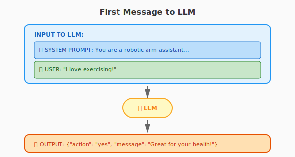
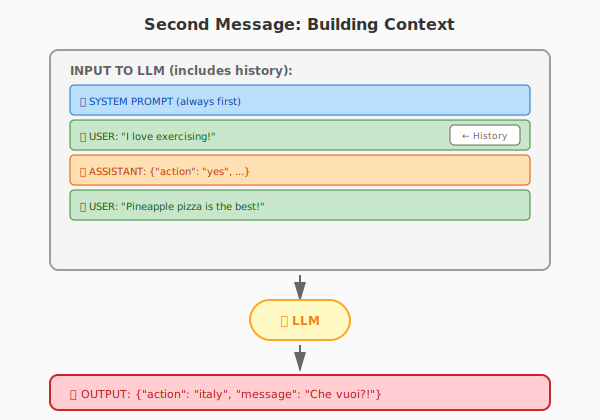
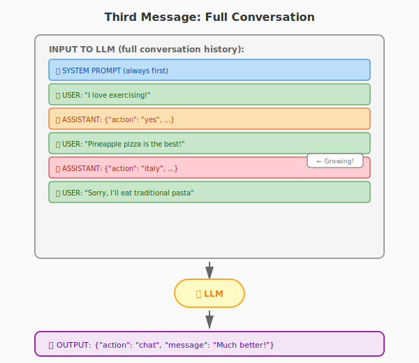
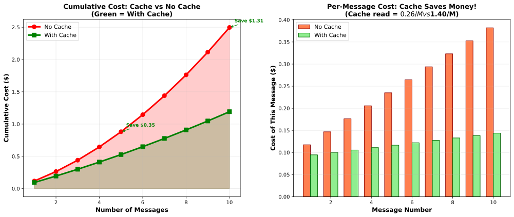

## Lesson 9 — LLM Robot Control via Tool Call

---

## What You Will Learn {.smaller-text}

By the end of this lesson you will understand:

- **What LLM Tool Call is** — how Large Language Models can invoke external functions to control hardware and perform actions

- **What System Prompt is** — the instructions that guide the LLM's behavior and define how it should respond and use available tools

- **The Importance of Cache in Tool Call** — why caching is critical for reducing latency, API costs, and improving response times in interactive robotics applications

---

## Hardware Setup: USB Hub Chain {.tiny-text}

**New Setup Rules:**

- **2 USB 3.0 hubs** — each shared by **2 groups only** (Hub A: Groups 1 & 2, Hub B: Groups 3 & 4)
- Each group connects to their assigned USB 3.0 hub via their USB 2.0 hub
- **Max 1 camera per USB 2.0 hub** — to ensure sufficient USB bandwidth
- USB 2.0 hub needs **external DC power supply**

```{mermaid}
%%{init: {'theme': 'base', 'themeVariables': { 'fontSize': '14px'}}}%%
flowchart LR
    U2A[USB 2.0<br/>Group 1] --> U3A[USB 3.0 Hub A]
    U2B[USB 2.0<br/>Group 2] --> U3A
    U2C[USB 2.0<br/>Group 3] --> U3B[USB 3.0 Hub B]
    U2D[USB 2.0<br/>Group 4] --> U3B
    
    U3A --> S[Server]
    U3B --> S
    
    style U2A fill:#c8e6c9,stroke:#2e7d32
    style U2B fill:#c8e6c9,stroke:#2e7d32
    style U2C fill:#c8e6c9,stroke:#2e7d32
    style U2D fill:#c8e6c9,stroke:#2e7d32
    style U3A fill:#fff9c4,stroke:#f9a825
    style U3B fill:#fff9c4,stroke:#f9a825
    style S fill:#bbdefb,stroke:#1565c0
```

---

## USB Setup: DO {.tiny-text}

### ✅ Correct Configuration

**Checklist:**

- [ ] Arms and camera connected to USB 2.0 hub
- [ ] USB 2.0 hub powered with DC adapter
- [ ] USB 2.0 hub connected to USB 3.0 hub
- [ ] USB 3.0 hub connected to server
- [ ] Maximum 1 camera per USB 2.0 hub

```{mermaid}
flowchart LR
    A[🤖 Arms] --> U2[USB 2.0 Hub]
    C[📷 1 Camera max] --> U2
    U2 --> U3[USB 3.0 Hub]
    U3 --> S[🖥️ Server]
    
    style U2 fill:#c8e6c9,stroke:#2e7d32
    style U3 fill:#fff9c4,stroke:#f9a825
    style S fill:#bbdefb,stroke:#1565c0
    style A fill:#e8f5e9,stroke:#4caf50
    style C fill:#e8f5e9,stroke:#4caf50
```

---

## USB Setup: DON'T {.tiny-text}

### ❌ Incorrect Configurations

**Never do this:**

- Never plug arms or cameras directly into the server
- Never plug arms or cameras directly into the USB 3.0 hub
- Never connect more than 1 camera to a USB 2.0 hub
- Never skip the USB 2.0 hub

```{mermaid}
flowchart LR
    A1[🤖 Arm] --> S1[🖥️ Server]
    C1[📷 Camera] --> S1
    
    A2[🤖 Arm] --> U3A[USB 3.0 Hub]
    C2[📷 Camera] --> U3A
    U3A --> S2[🖥️ Server]
    
    style A1 fill:#ffcdd2,stroke:#c62828
    style C1 fill:#ffcdd2,stroke:#c62828
    style S1 fill:#ffcdd2,stroke:#c62828
    style A2 fill:#ffcdd2,stroke:#c62828
    style C2 fill:#ffcdd2,stroke:#c62828
    style U3A fill:#ffcdd2,stroke:#c62828
    style S2 fill:#ffcdd2,stroke:#c62828
```

---

## Connecting to the Server {.tiny-text}

Recap from Lesson 2 — SSH into your group's shared Linux account:

**From macOS / Linux Terminal:**
```bash
ssh username@ip_address
```

**From Windows Terminal / PowerShell:**
```powershell
ssh username@ip_address
```

**Example:**
```bash
ssh so101p2g1@192.168.1.100
```

::: {.callout-tip}
If you set up SSH keys in Lesson 2, you can log in without a password.
Otherwise use the password provided by your tutor.
:::

---

## Quick SSH Checklist {.tiny-text}

### Before You Start

- [ ] Connected to course WiFi
- [ ] Know your group username (e.g., `so101p2g1`)
- [ ] Know the server IP address (from tutor)
- [ ] Terminal/Windows Terminal is open
- [ ] SSH command ready: `ssh username@ip_address`

### After Connecting

- [ ] Successfully logged in (no password prompt if using SSH keys)
- [ ] Can see the command prompt: `so101p2g1@server:~$`
- [ ] Ready to launch robot commands

---

## Part 1: Basic Robot Operations

Before diving into LLM control, let's review the fundamental ways to control the robot.

---

## 1. Teleoperation {.tiny-text}

### Demo: Teleoperation via Web UI

Watch how to control the robot using the leader-follower teleoperation interface.

::: {.video-container}

:::

---

## 1. Teleoperation — Try It Yourself {.tiny-text}

### Launch the Teleoperation Server

```bash
robot2
```

Then select option **2) teleop_control_server.py**

The server will start and display a URL. Open it in your browser to access the web UI.

**In the web UI:**

- Select your leader arm (black) and follower arm (white)
- Click **Connect**
- Click **Start Teleop**
- Move the leader arm to control the follower

::: {.callout-warning}
**Known Bug:** After multiple connect/disconnect cycles, teleoperation may develop high latency.

**Fix:** If this happens, restart the web server (Ctrl+C to stop, then run `robot2` again).
:::

---

## 2. Record and Playback from Teleop {.tiny-text}

### Demo: Recording Motion During Teleoperation

Watch how to record a motion while teleoperating the robot, then play it back.

::: {.video-container}

:::

---

## 2. Record and Playback from Teleop — Try It Yourself {.tiny-text}

### Using the Web UI

First launch with `robot2` → option **2) teleop_control_server.py**

**To record a motion:**

1. Connect your leader (black) and follower (white) arms
2. Start teleoperation
3. Click **Start Recording**
4. Move the leader arm to demonstrate the motion
5. Click **Stop Recording**
6. Download the saved motion file

**To playback a recorded motion:**

1. In the "Upload & Replay Motion" section, select your recorded file
2. Choose the arm (white) to play on
3. Set playback speed (0.5x, 1.0x, 1.5x, 2.0x)
4. Click **Start Playback**

---

## 3. Record by Hand (Kinesthetic Teaching) {.tiny-text}

### Demo: Recording by Moving the Arm by Hand

Watch how to record a motion by physically moving the arm by hand (with torque disabled).

::: {.video-container}

:::

---

## 3. Record by Hand — Try It Yourself {.tiny-text}

### Using the Web UI

::: {.callout-tip}
**Use this when:** Teleoperation has calibration problems (joint angle offset between leader and follower)
:::

**Steps:**

1. Launch: `robot2` → option **2**
2. In "Record by Hand" section, select a WHITE arm
3. Click **Connect** (disables torque, arm becomes backdrivable)
4. Physically move the arm by hand
5. Click **Start Recording** → demonstrate motion → **Stop Recording**
6. Download the motion file

**Playback:** Use "Upload & Replay Motion" section

---

## 4. The "Che vuoi?" Gesture {.tiny-text}

### An Italian Hand Gesture

The "[Che vuoi?](https://en.wikipedia.org/wiki/Che_vuoi%3F)" ("What do you want?") is a famous Italian hand gesture used to express:

- Disbelief or exasperation
- "What are you talking about?"
- "What do you want from me?"

::: {.two-column}
::: {.column}

{width="80%"}

:::

::: {.column}

{width="80%"}

:::
:::

---

## 4. Robot Performing "Che vuoi?" {.tiny-text}

### Demo: Italy Gesture on SO-101 Arm

Watch the SO-101 robot arm perform the "Che vuoi?" gesture!

::: {.video-container}

:::

---

## 4. Try It Yourself — Play the Italy Motion {.tiny-text}

### Run the Pre-recorded Action

```bash
robot2
```

Then select option **5) play_italy.py**

**What it does:**

- Prompts you to select a WHITE arm
- Plays the "Che vuoi?" gesture motion

---

## Summary: Basic Operations {.tiny-text}

### Quick Reference

| Operation | How to Launch | What to Do |
|-----------|---------------|------------|
| Teleoperation | `robot2` → **option 2** | Use web UI to connect arms and start teleop |
| Record from teleop | In web UI | Click Start/Stop Recording during teleop |
| Record by hand | In web UI | Use "Record by Hand" section |
| Play Italy motion | `robot2` → **option 5** | Select arm and play |

**Always remember to:**

- Use `robot2` command to launch the server
- Calibrate arms before first use
- Use WHITE arms for recording/playback
- Use BLACK arms as leaders for teleoperation

---

## Behind the Scenes: Motion Replay in 3 Lines {.tiny-text}

### The `play_italy.py` Script

Here's how simple it is to replay a recorded motion:

```python
from utils import replay

arm = replay.ArmReplay()
arm.play("utils/example_actions/Italy.json", playback_speed=1.0)
```

**That's it!** Just 3 lines of Python to play a recorded motion.

### Run It Manually

```bash
cd ~/IN097-phase2b
source phosphobot/.venv/bin/activate
python play_italy.py
```

---

## Activity: Create Your Own Motion Player {.tiny-text}

### Step 1: Record Your Own Actions

1. Launch the web UI: `robot2` → option **2**
2. Use either:
   - **Teleoperation recording** — Record while controlling the arm
   - **Record by hand** — Move the arm manually with torque off
3. Download your recorded motion files (`.json`)

---

## Activity: Create Your Own Motion Player {.tiny-text}

### Step 2: Upload to the Server

**Option A: Using VSCode**

- Use VSCode's remote SSH connection to your group account
- Drag and drop your `.json` files to `~/IN097-phase2b/recordings/`

**Option B: Using SCP**

```bash
# From your local machine:
scp my_motion.json username@server_ip:~/IN097-phase2b/recordings/
```

---

## Activity: Create Your Own Motion Player {.tiny-text}

### Step 3: Write a Script with Branching

Create a new file: `~/IN097-phase2b/play_my_motion.py`

```python
#!/usr/bin/env python3
from utils import replay

arm = replay.ArmReplay()

# Ask user which motion to play
print("Choose a motion:")
print("1) Wave hello")
print("2) Pick up")
print("3) Italy gesture")

choice = input("Enter 1, 2, or 3: ")

if choice == "1":
    arm.play("recordings/wave_hello.json")
elif choice == "2":
    arm.play("recordings/pick_up.json")
elif choice == "3":
    arm.play("utils/example_actions/Italy.json")
else:
    print("Invalid choice!")
```

---

## Activity: Create Your Own Motion Player {.tiny-text}

### Step 4: Run Your Script

```bash
cd ~/IN097-phase2b
source phosphobot/.venv/bin/activate
python play_my_motion.py
```

**Challenge:** Add more motions and menu options using additional `elif` statements!

---

## Part 2: LLM Tool Call Fundamentals

Now that you can record and play motions programmatically, let's explore how LLMs can control the robot.

---

## Why Use LLM for Action Selection? {.tiny-text}

### Limitations of Traditional Input Matching

The `input()` + `if/else` approach we just used has limitations:

- **Exact match required** — User must type "1", "2", or "3" precisely
- **No flexibility** — "Wave hello" and "wave" are treated as different inputs
- **No understanding** — The program doesn't understand what the user wants
- **Scalability issues** — Adding 20 motions means 20 elif statements

### LLM Advantages

- **Natural language understanding** — Users can say "do the Italy thing" or "make the hand gesture"
- **Context awareness** — LLM understands intent, not just keywords
- **Semantic matching** — "Exercise is good" and "I love working out" both trigger "yes"
- **Extensible** — Add new categories without rewriting code

---

## Demo: LLM-Controlled Robot Arm {.tiny-text}

### Watch the LLM Control the Robot

See how the LLM interprets natural language and triggers physical robot actions.

::: {.video-container}

:::

---

## Try It Yourself: LLM Arm Chat {.tiny-text}

### Launch the LLM Chat Interface

```bash
robot2
```

Then select option **6) llm_arm_chat.py**

**What it does:**

- Prompts you to select a WHITE arm
- Starts a chat interface with the LLM
- Type messages and watch the robot react!

---

## How It Works: llm_arm_chat.py {.tiny-text}

### The LLM's Behavior

The script uses an LLM (z-ai/glm-4.7-flash via OpenRouter) to classify your messages:

| If you say... | LLM Action | Robot Does |
|---------------|------------|------------|
| "Exercise is healthy" | `yes` | Nods yes 👍 |
| "I love brain rot videos" | `no` | Shakes no 👎 |
| "Pineapple pizza is the best" | `italy` | "Che vuoi?" gesture 🤌 |
| "What's the weather?" | `chat` | Just replies, no motion |

The LLM understands **intent**, not just keywords!

---

## What is Tool Calling? {.tiny-text}

### The Problem: LLMs Can Only Generate Text

LLMs are text generators. If an LLM says:

> "I want to nod my head"

Is it:

- Just thinking out loud?
- Explaining what it will do?
- **Actually requesting a physical action?**

**We can't tell!** Plain text is ambiguous.

---

## Why We Need Structured Tool Calls {.tiny-text}

### The Solution: Special Format (JSON)

To distinguish between **reasoning** and **actual commands**, we use a structured format:

**LLM Output:**
```json
{"action": "yes", "message": "Exercise is great for your health!"}
```

**Traditional Code Parses It:**
```python
import json

# LLM returns: '{"action": "yes", "message": "Exercise is great!"}'
response = json.loads(llm_output)

if response["action"] == "yes":
    robot.play("YesYes.json")  # Actually move!
print(response["message"])       # Just speak
```

**The JSON format makes the intent clear!**

---

## What is Tool Calling? {.tiny-text}

### The Concept

**Tool Calling** (also called Function Calling) allows LLMs to interact with the outside world by invoking functions.

Instead of just generating text, the LLM can:

- **Decide** which action to take
- **Output** structured data (like JSON)
- **Trigger** real-world events (robot movements!)

### In Our Code: The ACTIONS Dictionary

```python
ACTIONS = {
    "yes": "utils/example_actions/YesYes.json",
    "no": "utils/example_actions/NoNoNo.json",
    "italy": "utils/example_actions/Italy.json",
}
```

The LLM returns an action name → The script looks it up → Robot plays the motion!

---

## What is a System Prompt? {.tiny-text}

### The Concept

A **System Prompt** is the "instructions" you give to the LLM before the conversation starts. It defines:

- What the LLM's role is
- What actions it can take
- How it should respond
- Output format requirements

---

## First Message: What Goes to the LLM {.tiny-text}

### Initial Request

{width="80%"}

**Note:** The system prompt is always included first!

---

## Second Message: Building Context {.tiny-text}

### Conversation History Accumulates

{width="80%"}

**The LLM sees the entire conversation history!**

---

## Third Message: Full Conversation {.tiny-text}

### Context Keeps Growing

{width="80%"}

---

## Our SYSTEM_PROMPT Code {.tiny-text}

### The Actual Implementation

```python
SYSTEM_PROMPT = """\
You are a robotic arm assistant that classifies user statements...

Available actions:
- "yes":  The user says something good, positive, healthy...
- "no":   The user says something bad, negative...
- "italy": The user says something that insults Italy...
- "chat": Normal conversation...

You must respond ONLY in valid JSON format:
{"action": "yes|no|italy|chat", "message": "Your response"}

If the action is not "chat", the robot will physically perform
the corresponding gesture after delivering your message.
"""
```

---

## System Prompt: Key Elements {.tiny-text}

### Breaking Down the Instructions

| Element | Purpose | Example from Our Code |
|---------|---------|----------------------|
| **Role** | Define who the LLM is | "You are a robotic arm assistant" |
| **Available Tools** | List possible actions | `yes`, `no`, `italy`, `chat` |
| **Conditions** | When to use each action | "positive/healthy" → `yes` |
| **Output Format** | Structure of response | JSON with `action` and `message` |
| **Side Effects** | What happens after | "robot will physically perform..." |

**The system prompt is like a contract** — it tells the LLM exactly what to do and how to behave!

---

## How It All Works Together {.tiny-text}

### The Flow

```
User: "I love exercising!"
        ↓
LLM reads SYSTEM_PROMPT (understands it should classify)
        ↓
LLM returns: {"action": "yes", "message": "That's great!"}
        ↓
Script looks up ACTIONS["yes"] → "utils/example_actions/YesYes.json"
        ↓
Robot plays the YesYes motion while saying "That's great!"
```

**Without tool calling:** The LLM just replies "Exercise is good for you"

**With tool calling:** The LLM triggers a physical action + reply!

---

## Why Caching Matters: Understanding Tokens {.tiny-text}

### What is a Token?

A **token** is the basic unit that LLMs process. It can be:

- A word ("hello")
- Part of a word ("running" = "run" + "ning")
- A single character ("a", "!")
- Or even whitespace

**Example:**

```
"I love robotics!" → ["I", " love", " robotics", "!"]
       4 words           4 tokens
```

**Why it matters:** LLM APIs charge **per token**, not per request!

---

## LLM API Pricing Model {.tiny-text}

### Pay Per Token

LLM providers charge for:

- **Input tokens** — Everything you send TO the LLM (system prompt + conversation history)
- **Output tokens** — Everything the LLM sends back

**GLM 5.1 Pricing Example:**

| Type | Price |
|------|-------|
| Input | $1.40 per million tokens |
| Output | $4.40 per million tokens |

---

## The Problem: Cumulative Cost {.tiny-text}

### Watch How Context Grows With Each Message

::: {.three-images}
{width="32%"}
{width="32%"}
{width="32%"}
:::

**Input tokens grow rapidly:**

- Message 1: System (20k) + User (1k) = **21k tokens**
- Message 2: + History (21k) + User (1k) = **42k tokens**
- Message 3: + History (42k) + User (1k) = **63k tokens**

**The entire conversation history is sent every time!**

---

## What is Caching? {.tiny-text}

### The Problem: Repeated Context

Every message sends the **entire conversation history** as input:

- Message 1: System (20k) + User (1k) = 21k tokens
- Message 2: System (20k) + User1 (1k) + Assistant1 (20k) + User2 (1k) = 42k tokens
- Message 3: Everything before + new messages = 63k tokens

**We're re-processing the same tokens over and over!**

---

## The Solution: Prompt Caching {.tiny-text}

### What is Caching?

**Caching** stores previously processed tokens so you don't pay full price to reprocess them.

**How it works:**

- First request: Pay full price to process system prompt + context

- Subsequent requests: Pay **cache read price** ($0.26/M) for cached tokens

- Only pay full price for NEW tokens

**GLM 5.1 Cache Pricing:**

| Type | Price |
|------|-------|
| Input (no cache) | $1.40/M tokens |
| Cache Read | **$0.26/M tokens** (81% cheaper!) |
| Output | $4.40/M tokens |

---

## Caching in Our Code {.tiny-text}

### Cache is Enabled in llm_arm_chat.py

```python
response = client.chat.completions.create(
    model=MODEL,
    messages=messages,
    extra_headers={
        "X-OpenRouter-Cache": "true",  # ← Cache enabled!
    },
)
```

The `X-OpenRouter-Cache: true` header tells OpenRouter to cache the prompt and charge the cheaper cache read price for repeated context!

---

## Cost Comparison Graph {.tiny-text}

### Cache vs No Cache

{width="85%"}

---

## Cost Comparison: The Numbers {.tiny-text}

### See the Savings!

**Assumptions:**

- GLM 5.1 Pricing: Input $1.40/M, Cache Read $0.26/M, Output $4.40/M

- System Prompt: 20,000 tokens

- User Message: 1,000 tokens

- LLM Output: 20,000 tokens

**After 10 messages:**

- No Cache: **$2.50**

- With Cache: **$1.19**

- **You save $1.31 (52%!)**

---

## The Solution: Caching {.tiny-text}

### What is Caching?

**Caching** stores previous LLM responses to avoid redundant API calls.

**Without caching:**

- Every message sends full conversation history
- Cost grows linearly (or worse!)

**With caching:**

- Store frequent responses locally
- Reuse them without calling the API
- Save money and reduce latency!

---

## Summary: Key Takeaways {.tiny-text}

### What We Learned About Caching

- ✅ **Tokens** are the billing unit for LLM APIs
- ✅ **Costs accumulate quadratically** because conversation history is sent every time
- ✅ **Caching** stores previously processed tokens at a cheaper rate ($0.26/M vs $1.40/M)
- ✅ **Benefits:** Lower costs + faster responses

### Real Numbers (10 messages):

| Scenario | Cost | Savings |
|----------|------|---------|
| No Cache | $2.50 | — |
| With Cache | $1.19 | **$1.31 (52%)** |

### In Robot Control:

Caching is crucial for real-time robot control where:
- Similar commands are issued repeatedly
- Low latency is essential
- API costs should be minimized

---

## Final Activity: Improve the LLM Robot Controller {.tiny-text}

### Modify `llm_arm_chat.py`

Now it's your turn to customize the LLM robot controller! Here are three ways to improve it:

---

## Option 1: Add Your Own Actions {.tiny-text}

### Record and Upload Custom Motions

**Steps:**

1. Record your own motion using the web UI (`robot2` → option 2)

2. Download the `.json` file and upload to `~/IN097-phase2b/recordings/`

3. Add your action to the `ACTIONS` dictionary:

```python
ACTIONS = {
    "yes": "utils/example_actions/YesYes.json",
    "no": "utils/example_actions/NoNoNo.json",
    "italy": "utils/example_actions/Italy.json",
    "wave": "recordings/my_wave.json",  # ← Your new action!
}
```

4. Update the `SYSTEM_PROMPT` to describe when to use your action

---

## Option 2: Modify the System Prompt {.tiny-text}

### Change the LLM's Behavior

Edit the `SYSTEM_PROMPT` to:

- Change the robot's personality (friendly, sarcastic, professional)

- Add new action categories

- Modify the classification criteria

- Change the response format

**Example:** Make the robot respond like a pirate:

```python
SYSTEM_PROMPT = """\
You are a pirate robot assistant. Respond with pirate slang!

Available actions:
- "aye": The user says something good
- "nay": The user says something bad
...
"""
```

---

## Option 3: Try a Different Model {.tiny-text}

### Upgrade to a More Powerful LLM

Change the `MODEL` variable:

```python
# Current model (cheaper, faster)
MODEL = "z-ai/glm-4.7-flash"

# More powerful options (more expensive!)
MODEL = "z-ai/glm-5.1"
# Or
MODEL = "moonshotai/kimi-k2.6"
```

::: {.callout-warning}
**⚠️ Warning: Costs Money!**

- Each group has an OpenRouter API key
- Every API call costs real money
- More powerful models = higher cost per token
- Monitor your usage!
:::

---

## Activity Guidelines {.tiny-text}

### Tips for Success

1. **Start small** — Make one change at a time

2. **Test frequently** — Run `robot2` → option 6 to test

3. **Save backups** — Copy your file before making big changes:
   ```bash
   cp llm_arm_chat.py llm_arm_chat_backup.py
   ```

4. **Check costs** — If using expensive models, limit your testing

5. **Be creative!** — The best projects have unique personalities

---

## Running Your Modified Script {.tiny-text}

### Commands to Test Your Changes

```bash
# Navigate to the project directory
cd ~/IN097-phase2b

# Activate the virtual environment
source phosphobot/.venv/bin/activate

# Run your modified script
python llm_arm_chat.py
```

---

## Recording Your Demo {.tiny-text}

### Capture Your Robot in Action

**To view the camera feed:**

```bash
robot2
```

Then select option **3) camera_stream_server.py**

This starts a camera streaming server so you can see what the robot sees!

**To record your demo:**

- Use your computer's screen capture/recording software

- Record the camera feed + your terminal/chat interface

- Show off your custom robot behaviors!

---

## Show and Tell {.tiny-text}

### Share Your Creation!

At the end of the session:

- Demonstrate your modified robot controller

- Explain what you changed and why

- Share any interesting behaviors you discovered

**Have fun building your AI robot! 🤖**
