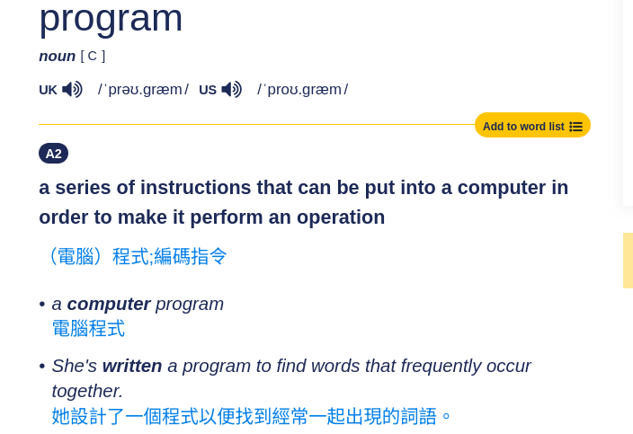
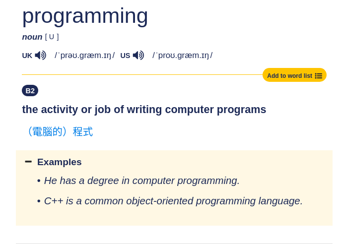

## What is programming?

<iframe src="stl_viewer.html" width="600" height="500" style="border:none;"></iframe>

::: {.notes}
Programming is the act of giving precise instructions to a machine so it can perform a task. Just like a sculptor shapes marble, a programmer shapes the behaviour of a computer.
:::

---

## What LinkedIn thinks programming is

[https://www.polytranslator.com/linkedin-speak/](https://www.polytranslator.com/linkedin-speak/)

::: {.notes}
This is what the "LinkedIn speak translator" returns for the word "programming". It is a fun reminder that the same word can sound very different depending on the audience.
:::

---

## The dictionary definitions

:::: {.columns}

::: {.column width="50%"}

:::

::: {.column width="50%"}

:::

::::

::: {.notes}
Oxford defines a program as a set of instructions that control the operations of a machine. Programming is the activity of writing those instructions.
:::

---

## Programming has evolved

- **Past:** We wrote every step in code (loops, conditions, memory management).
- **Now:** We can describe *goals and constraints* in natural language and let a model figure out the steps.
- **Latest shift:** We can control the **behaviour of an entire system** by tuning the **system prompt** of a Large Language Model (LLM).

::: {.notes}
The job of a programmer is no longer just writing code line by line. Increasingly, it is about designing the right instructions, context, and guardrails for an AI system.
:::

---

## Your task in this course

You will tune the **system prompt** of a robot-arm system so that it does what you want.

Think of the prompt as the robot's job description:

- What is its role?
- What should it do?
- What must it avoid?
- How should it respond when something goes wrong?

::: {.notes}
The system prompt is the first and most important message the model sees. It sets the stage for every later decision the robot arm makes.
:::

---

## Tip 1: Give the LLM a clear job description

Without a system prompt, the LLM has no idea what it needs to do.

{width=60%}

::: {.notes}
An LLM without a system prompt is powerful but directionless. It has general knowledge, but no specific mission.
:::

---

## Analogy: pulling a random person off the street

Imagine you pull a random person off the street, put them in an excavator, and say:

> "Dig."

They would not know:

- How to drive the excavator
- Where to dig
- How large the pit should be
- What hazards to watch for

The system prompt is the menu or instruction sheet that answers those questions.

::: {.notes}
The system prompt is the menu or instruction sheet. It tells the operator how to control the machine, where the target is, and what success looks like.
:::

---

## Tip 2: Experience does not transfer across sessions

If an LLM accumulates experience during a chat session, that experience **disappears** when you start a new session.

This is like how different people trip on the same uneven step: each new walker does not inherit the muscle memory of the previous one.

[See this video of people tripping on the same spot](https://www.reddit.com/r/Damnthatsinteresting/comments/1n9hwe6/the_brain_memorizes_the_rhythm_of_stairs_after/)

::: {.notes}
When you start a new conversation, the model is reset. It does not remember the mistakes or successes from the previous run. Therefore, whenever you notice a recurring mistake, update the system prompt so every future session starts with that lesson baked in.
:::

---

## Practical workflow for system-prompt tuning

1. **Run the system** with the current prompt.
2. **Watch the failure.** What did the model do wrong?
3. **Update the system prompt** with a clearer rule, example, or constraint.
4. **Start a new session** and test again.
5. **Repeat** until the behaviour is reliable.

::: {.notes}
Tuning a system prompt is an iterative process. Each failure is useful feedback. Write the fix into the prompt so the next fresh session inherits it.
:::

---

## Limitations of system-prompt tuning

System prompts are powerful, but they are not magic.

| Problem | Why prompt tuning may not be enough |
|---------|-------------------------------------|
| Wrong tool or API | The code itself may need to change. |
| Unsafe or impossible action | No prompt can bypass physics or security. |
| Consistent reasoning errors | The model may lack the right internal knowledge. |
| Repeated hallucinations | Researchers may need to update the model weights or training data. |

::: {.notes}
Sometimes the best fix is not a better prompt but a better function, a safer API, or a more capable model. Prompt engineering is one tool in a larger toolbox.
:::

---

## When to go deeper

- **Prompt tuning** is the fastest first step.
- **Code changes** are needed when the logic, data flow, or tools are wrong.
- **Model tuning (weights / training)** is needed when the model repeatedly lacks the capability, knowledge, or reasoning pattern required for the task.

::: {.notes}
A good engineer knows which lever to pull. Start with the prompt, but do not be afraid to change the code or even retrain the model when the problem truly lies there.
:::

---

## Summary

- Programming = giving precise instructions to control a system.
- Today, those instructions can be a **system prompt** for an LLM.
- A clear prompt is like a good instruction menu for an excavator operator.
- Mistakes in one session do not transfer; bake the lessons into the prompt.
- Prompts have limits — sometimes you still need to change the **code** or the **model weights**.

::: {.notes}
The goal of this course is to give you practical experience tuning system prompts for a robot arm. Keep these principles in mind as you iterate.
:::
